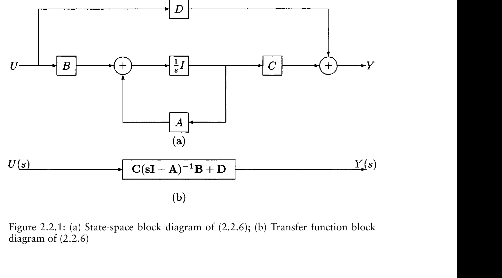

# Lecture 01 - Control Theory Preliminaries

Source: handwritten lecture notes, cross-checked with the listed course reference.

## Big Picture

Control theory begins with a deceptively simple question: how can we describe a physical system well enough that we can deliberately change its behavior? The answer in this lecture is the state. A state is not merely a list of variables; it is a compact memory of the system. Once the state and the input are known, the future is determined by the model.

This lecture builds the language used in the rest of the course:

- continuous-time and discrete-time systems,
- state-space models,
- transfer functions,
- nonlinear state equations,
- norms of vectors, matrices, functions, and systems,
- matrix definiteness and stability-related algebra.

The intellectual move is from "input goes in, output comes out" toward "the internal state evolves, and the controller shapes that evolution."

## Learning Path

1. Describe physical systems using differential equations.
2. Convert differential equations to state-space form.
3. Derive transfer functions from state-space models.
4. Extend the notation to nonlinear systems.
5. Introduce norms and matrix properties needed for stability.

## Continuous-Time Control Systems

A continuous-time system maps an input signal `u(t)` to an output signal `y(t)`.

For a linear single-input single-output system, the relation may be described by an ordinary differential equation:

```math
a_n\frac{d^ny}{dt^n}
a_{n-1}\frac{d^{n-1}y}{dt^{n-1}}
\cdots
a_1\dot{y}
a_0y
=
b_m\frac{d^mu}{dt^m}
\cdots
b_1\dot{u}
b_0u
```

Important vocabulary:

- SISO: single input, single output.
- MIMO: multiple inputs, multiple outputs.
- Linear: superposition holds.
- Time invariant: the model does not explicitly change with time.

## State-Space Representation

The state vector is the smallest set of variables needed to determine the future behavior of the system, given the future input.

The continuous-time linear state-space model is:

```math
\dot{x}=Ax+Bu
```

```math
y=Cx+Du
```

where:

- `x` is the state vector,
- `u` is the input,
- `y` is the output,
- `A` is the system matrix,
- `B` is the input matrix,
- `C` is the output matrix,
- `D` is the direct feedthrough matrix.



*Textbook screenshot source: [R1, Fig. 2.2.1].*

## Spring-Mass-Damper Example

Consider:

```math
M\ddot{x}+B\dot{x}+Kx=F(t)
```

Choose:

```math
x_1=x,\qquad x_2=\dot{x}
```

Then:

```math
\dot{x}_1=x_2
```

```math
\dot{x}_2=-\frac{K}{M}x_1-\frac{B}{M}x_2+\frac{1}{M}F(t)
```

With:

```math
X=
\begin{bmatrix}
x_1\\
x_2
\end{bmatrix}
```

the state-space form is:

```math
\dot{X}
=
\begin{bmatrix}
0&1\\
-K/M&-B/M
\end{bmatrix}X
+
\begin{bmatrix}
0\\
1/M
\end{bmatrix}F
```

If the output is position:

```math
y=
\begin{bmatrix}
1&0
\end{bmatrix}X
```

## State Variables Are Not Unique

The same physical system can be represented with different state variables. For example:

```math
\bar{x}_1=x,\qquad \bar{x}_2=x+\dot{x}
```

This gives a different state-space realization, but the physical input-output behavior is unchanged. State variables are coordinates for describing the system; different coordinates can describe the same motion.

## General Differential Equation to State Space

For:

```math
y^{(n)}+a_{n-1}y^{(n-1)}+\cdots+a_1\dot{y}+a_0y=u
```

choose:

```math
x_1=y,\quad x_2=\dot{y},\quad \ldots,\quad x_n=y^{(n-1)}
```

Then:

```math
\dot{x}_1=x_2,\quad
\dot{x}_2=x_3,\quad
\ldots,\quad
\dot{x}_{n-1}=x_n
```

```math
\dot{x}_n=-a_0x_1-a_1x_2-\cdots-a_{n-1}x_n+u
```

This is the controllable canonical form.

## Double Integrator

The simplest motion model is:

```math
\ddot{y}=u
```

Choose:

```math
x_1=y,\qquad x_2=\dot{y}
```

Then:

```math
\dot{x}=
\begin{bmatrix}
0&1\\
0&0
\end{bmatrix}x
+
\begin{bmatrix}
0\\
1
\end{bmatrix}u
```

```math
y=
\begin{bmatrix}
1&0
\end{bmatrix}x
```

This model reappears later when computed-torque control cancels robot nonlinearities and leaves joint acceleration as the command input.

## Transfer Function From State Space

Starting from:

```math
\dot{x}=Ax+Bu,\qquad y=Cx+Du
```

take the Laplace transform:

```math
sX(s)-x(0)=AX(s)+BU(s)
```

Assuming zero initial condition:

```math
(sI-A)X(s)=BU(s)
```

so:

```math
X(s)=(sI-A)^{-1}BU(s)
```

Substitute into the output:

```math
Y(s)=\left[C(sI-A)^{-1}B+D\right]U(s)
```

Therefore:

```math
G(s)=\frac{Y(s)}{U(s)}
=
C(sI-A)^{-1}B+D
```

For the double integrator:

```math
\ddot{y}=Ku
```

the transfer function is:

```math
G(s)=\frac{K}{s^2}
```

## Discrete-Time Systems

In discrete time:

```math
x(k+1)=Ax(k)+Bu(k)
```

```math
y(k)=Cx(k)+Du(k)
```

The discrete transfer function is:

```math
G(z)=C(zI-A)^{-1}B+D
```

Discrete-time notation matters because real simulations and digital controllers run at sampled instants, even when the original design is continuous.

## Nonlinear State-Space Systems

Many physical systems are nonlinear:

```math
\dot{x}=f(x,u,t)
```

```math
y=h(x,u,t)
```

Autonomous nonlinear system:

```math
\dot{x}=f(x)
```

Nonautonomous nonlinear system:

```math
\dot{x}=f(x,t)
```

A useful control-affine form is:

```math
\dot{x}=f(x)+g(x)u
```

Robotic systems naturally lead to nonlinear state-space models because inertia, Coriolis terms, and trigonometric geometry depend on configuration and velocity.

## Nonlinear Discrete-Time Systems

The discrete-time nonlinear counterpart is:

```math
x(k+1)=f(x(k),u(k),k)
```

```math
y(k)=h(x(k),u(k),k)
```

For time-invariant discrete nonlinear systems:

```math
x(k+1)=f(x(k),u(k))
```

and for autonomous discrete systems:

```math
x(k+1)=f(x(k))
```

An equilibrium `x_e` for the autonomous discrete system satisfies:

```math
x_e=f(x_e)
```

The stability question then becomes: if `x(0)` starts near `x_e`, do the iterates `x(k)` remain near it and possibly converge to it as `k\to\infty`?

## Nonlinear Examples

### Damped pendulum

```math
\ddot{y}+b\dot{y}+\sin(y)=0
```

Choose:

```math
x_1=y,\qquad x_2=\dot{y}
```

Then:

```math
\dot{x}_1=x_2
```

```math
\dot{x}_2=-bx_2-\sin(x_1)
```

The sine term makes the system nonlinear.

### Van der Pol type oscillator

The lecture also uses nonlinear oscillator examples to show that nonlinear systems can have behavior impossible to see from a constant matrix `A` alone.

## Norms

Norms measure size. For:

```math
x=
\begin{bmatrix}
x_1&x_2&\cdots&x_n
\end{bmatrix}^T
```

common vector norms are:

```math
\|x\|_1=\sum_i |x_i|
```

```math
\|x\|_2=\sqrt{x^Tx}
```

```math
\|x\|_p=\left(\sum_i |x_i|^p\right)^{1/p}
```

```math
\|x\|_\infty=\max_i |x_i|
```

In finite-dimensional vector spaces, all norms are equivalent: if a vector is bounded in one norm, it is bounded in the others.

## Matrix Norms

An induced matrix norm is:

```math
\|A\|=\max_{x\neq 0}\frac{\|Ax\|}{\|x\|}
```

It satisfies:

```math
\|Ax\|\le \|A\|\|x\|
```

Common matrix norms:

```math
\|A\|_\infty=\max_i\sum_j |a_{ij}|
```

```math
\|A\|_1=\max_j\sum_i |a_{ij}|
```

```math
\|A\|_2=\sqrt{\lambda_{\max}(A^TA)}
```

For symmetric matrices:

```math
\|A\|_2=\max_i|\lambda_i(A)|
```

## Function and System Norms

For a function:

```math
\|f\|_p=
\left(\int_{t_0}^{t_1}\|f(t)\|^pdt\right)^{1/p}
```

and:

```math
\|f\|_\infty=\max_{t\in[t_0,t_1]}\|f(t)\|
```

For a system operator `H`:

```math
y=Hu
```

the induced system gain is:

```math
\|H\|=\sup_{u\neq 0}\frac{\|Hu\|}{\|u\|}
```

Bounded-input bounded-output stability means:

```math
\|u\|<\infty \Rightarrow \|y\|<\infty
```

## Inner Products

An inner product generalizes the dot product. For real vectors:

```math
\langle x,y\rangle=x^Ty
```

It satisfies:

- symmetry:

```math
\langle x,y\rangle=\langle y,x\rangle
```

- linearity in each argument:

```math
\langle ax_1+bx_2,y\rangle
=
a\langle x_1,y\rangle+b\langle x_2,y\rangle
```

- positivity:

```math
\langle x,x\rangle>0,\qquad x\neq 0
```

The Euclidean norm is induced by the inner product:

```math
\|x\|_2=\sqrt{\langle x,x\rangle}
```

For functions, an important inner product is:

```math
\langle f,g\rangle
=
\int_{t_0}^{t_1} f^T(t)g(t)\,dt
```

This connects signal energy with `L_2` norms:

```math
\|f\|_2^2=\langle f,f\rangle
```

## Matrix Definiteness

For a symmetric matrix `A`:

Positive definite:

```math
x^TAx>0,\qquad \forall x\neq 0
```

Positive semidefinite:

```math
x^TAx\ge 0,\qquad \forall x
```

Negative definite:

```math
x^TAx<0,\qquad \forall x\neq 0
```

Skew-symmetric:

```math
A^T=-A
```

For skew-symmetric `A`:

```math
x^TAx=0
```

For a real symmetric matrix, positive definiteness is equivalent to all eigenvalues being positive.

For a `2 x 2` symmetric matrix:

```math
A=
\begin{bmatrix}
a&b\\
b&d
\end{bmatrix}
```

positive definiteness requires:

```math
a>0,\qquad ad-b^2>0
```

## What to Remember

This lecture gives the grammar of the course. State-space models say how systems evolve; transfer functions say how linear systems transform inputs into outputs; norms and matrix definiteness give us the language to discuss size, boundedness, and stability. The later robot controllers are not separate from this lecture. They are this lecture wearing more geometry.
