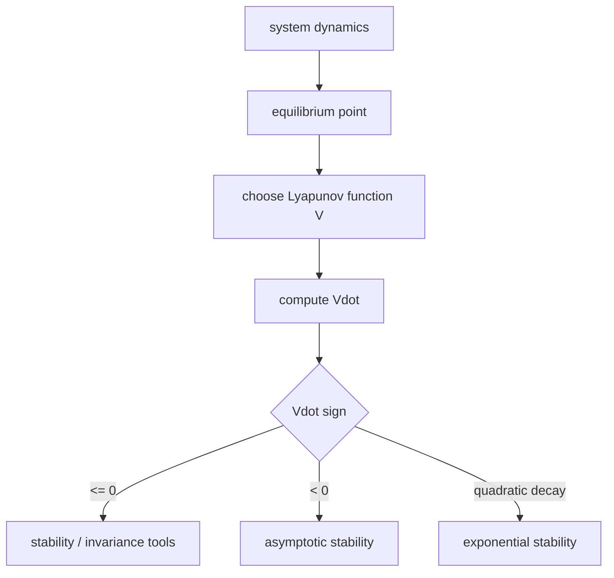

# Lecture 02 - Stability and Lyapunov Theory

Original handwritten source: `Lex/Lecture02-03.pdf`, Lecture 2 portion

Reference check:

- Checked against Ref.1 stability/Lyapunov material listed in `Table of Contents.pdf`.
- The handwritten lecture order is kept as primary. Ref.1 is used only to confirm definitions and standard theorem statements.

## Big Picture

Stability theory is the part of control that asks whether our mathematical promises survive time. It is not enough for a controller to look clever at the instant it is written down; the closed-loop system must stay near what we want, converge when required, and remain bounded when the world is imperfect.

This lecture introduces Lyapunov theory, which is the art of proving stability without solving the differential equation. That is the great trick: instead of tracking every trajectory directly, we build an energy-like scalar function and show that the system cannot climb uphill forever.

## Learning Path

1. Define equilibrium points.
2. Distinguish stability, convergence, asymptotic stability, and exponential stability.
3. Introduce boundedness and ultimate boundedness.
4. Build Lyapunov functions.
5. Use LaSalle, passivity, Bellman-Gronwall, and Barbalat as supporting tools.



## Equilibrium Points

For a nonlinear system:

```math
\dot{x}=f(x,t)
```

an equilibrium point `x_e` satisfies:

```math
f(x_e,t)=0
```

For an autonomous system:

```math
\dot{x}=f(x)
```

the equilibrium condition is:

```math
f(x_e)=0
```

The notes use simple second-order examples to show that equilibria are found by setting the state derivatives to zero.

## Stability Concept

Stability asks whether a trajectory that starts close to an equilibrium stays close to it.

An equilibrium `x_e` is stable if for every `\epsilon>0`, there exists a `\delta>0` such that:

```math
\|x(t_0)-x_e\|<\delta
\Rightarrow
\|x(t)-x_e\|<\epsilon,\qquad \forall t\ge t_0
```

The lecture drawings show a tube around the equilibrium: if the trajectory starts inside a small ball, it stays inside the larger allowed ball.

## Convergence

Convergence means:

```math
\lim_{t\to\infty}x(t)=x_e
```

The important distinction:

- Stability: the trajectory remains close.
- Convergence: the trajectory approaches the equilibrium.
- Asymptotic stability: both properties hold.

## Asymptotic Stability

An equilibrium is asymptotically stable if:

1. It is stable.
2. It is attractive:

```math
\lim_{t\to\infty}x(t)=x_e
```

Global asymptotic stability means the attraction holds for every initial condition:

```math
\forall x(t_0)\in\mathbb{R}^n
```

Local asymptotic stability only holds inside some neighborhood of the equilibrium.

## Uniform Stability and Exponential Stability

Uniform stability means the stability bound can be chosen independently of the initial time `t_0`.

Exponential stability gives a stronger decay estimate:

```math
\|x(t)-x_e\|
\le
k e^{-\alpha(t-t_0)}\|x(t_0)-x_e\|
```

where:

```math
k>0,\qquad \alpha>0
```

Global exponential stability means this bound holds globally.

## Boundedness and Ultimate Boundedness

Boundedness:

```math
\|x(t)\|\le c
```

for all relevant time.

Uniform boundedness means the bound does not depend on the initial time.

Uniform ultimate boundedness means trajectories eventually enter a ball:

```math
\|x(t)\|\le b,\qquad t\ge t_0+T
```

This concept becomes important in robust control, where exact convergence may be replaced by convergence to a small residual set.

## Class K Functions

A function `\alpha(r)` is class `K` if:

- `\alpha(0)=0`
- `\alpha(r)>0` for `r>0`
- `\alpha(r)` is strictly increasing

Class `K` functions are used to bound Lyapunov functions:

```math
\alpha_1(\|x\|)
\le
V(x,t)
\le
\alpha_2(\|x\|)
```

## Positive Definite and Negative Definite Functions

A scalar function `V(x)` is positive definite if:

```math
V(0)=0,\qquad V(x)>0\quad \forall x\neq 0
```

It is positive semidefinite if:

```math
V(0)=0,\qquad V(x)\ge 0
```

It is negative definite if:

```math
V(0)=0,\qquad V(x)<0\quad \forall x\neq 0
```

Example:

```math
V(x)=x^2
```

is positive definite, while:

```math
V(x)=-x^2
```

is negative definite.

## Decrescent Functions

`V(x,t)` is decrescent if it can be upper bounded by a function of `\|x\|`:

```math
V(x,t)\le \beta(\|x\|)
```

for a class `K` function `\beta`.

This property is needed in some uniform stability theorems.

## Lyapunov Derivative

For:

```math
\dot{x}=f(x,t)
```

the derivative of `V(x,t)` along system trajectories is:

```math
\dot{V}
=
\frac{\partial V}{\partial t}
+
\frac{\partial V}{\partial x}f(x,t)
```

This derivative is not an arbitrary time derivative; it is evaluated along solutions of the differential equation.

## Lyapunov Stability Theorem

If there exists a function `V(x,t)` such that:

```math
V(x,t)>0,\qquad x\neq 0
```

and:

```math
\dot{V}(x,t)\le 0
```

then the equilibrium is stable.

If:

```math
\dot{V}(x,t)<0
```

then asymptotic stability can often be concluded.

For exponential stability, a common sufficient condition is:

```math
\alpha\|x\|^2\le V(x,t)\le \beta\|x\|^2
```

```math
\dot{V}(x,t)\le -\gamma\|x\|^2
```

with positive constants `\alpha,\beta,\gamma`.

## Lyapunov Examples

For second-order systems, a natural Lyapunov function is often:

```math
V=\frac{1}{2}x_1^2+\frac{1}{2}x_2^2
```

or, in mechanical systems:

```math
V=\text{kinetic energy}+\text{potential-like error energy}
```

The lecture examples show that the hard part is not differentiating `V`; it is choosing a useful `V`.

## LaSalle Invariance Principle

If:

```math
\dot{V}\le 0
```

but not strictly negative, LaSalle's theorem can still prove convergence.

The idea is to find the largest invariant set inside:

```math
\{x:\dot{V}(x)=0\}
```

If the largest invariant set is only the origin, then the origin is asymptotically stable.

## LTI Stability and Lyapunov Equation

For:

```math
\dot{x}=Ax
```

the origin is asymptotically stable if all eigenvalues of `A` have negative real parts.

Lyapunov equation:

```math
A^TP+PA=-Q
```

If:

```math
Q=Q^T>0
```

and a solution:

```math
P=P^T>0
```

exists, then the system is stable using:

```math
V=x^TPx
```

## Passivity

Passivity is an input-output energy property. A passive system satisfies an inequality like:

```math
\dot{V}\le u^Ty
```

where `V` is a storage function.

Robotic systems have passivity-like structure because kinetic energy and torque-power relationships naturally appear:

```math
\tau^T\dot{q}
```

## Bellman-Gronwall Inequality

The Bellman-Gronwall inequality is used to bound functions satisfying integral inequalities.

A common form:

```math
x(t)\le a+\int_{t_0}^t b(\sigma)x(\sigma)d\sigma
```

implies an exponential-type upper bound on `x(t)`.

## Barbalat Lemma

Barbalat's lemma is used frequently in robot control.

A common version:

If `f(t)` is uniformly continuous and:

```math
\int_0^\infty f(t)dt
```

exists and is finite, then:

```math
f(t)\to 0
```

In control proofs, we often show:

1. `V(t)` is bounded and nonincreasing.
2. A signal like `r(t)` is square integrable.
3. `\dot{r}(t)` is bounded, so `r(t)` is uniformly continuous.
4. Therefore `r(t)\to 0`.
