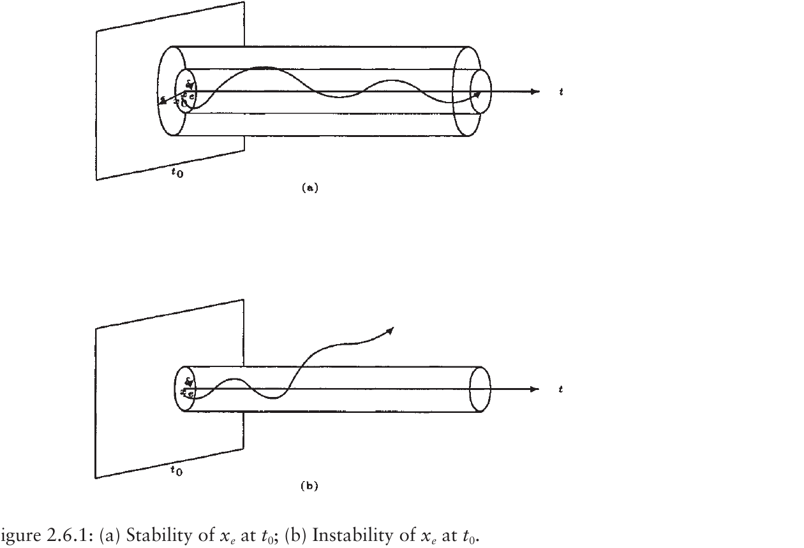
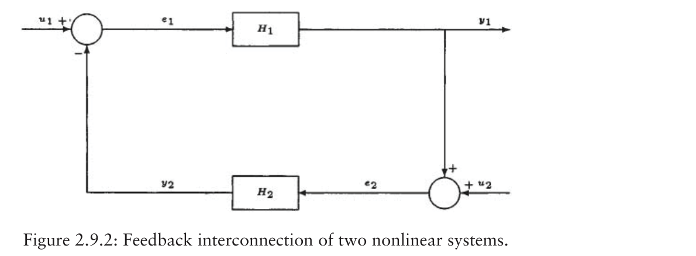

# Lecture 02 - Stability and Lyapunov Theory

## Big Picture

Stability theory is the part of control that asks whether our mathematical promises survive time. It is not enough for a controller to look clever at the instant it is written down; the closed-loop system must stay near what we want, converge when required, and remain bounded when the world is imperfect.

This lecture introduces Lyapunov theory, which is the art of proving stability without solving the differential equation. That is the great trick: instead of tracking every trajectory directly, we build an energy-like scalar function and show that the system cannot climb uphill forever.

## Learning Path

1. Define equilibrium points.
2. Distinguish stability, convergence, asymptotic stability, and exponential stability.
3. Introduce boundedness and ultimate boundedness.
4. Build Lyapunov functions.
5. Use LaSalle, passivity, Bellman-Gronwall, and Barbalat as supporting tools.



*Textbook screenshot source: [R1, Fig. 2.6.1].*

## Equilibrium Points

For a nonlinear system:

```math
\dot{x}=f(x,t)
```

an equilibrium point `x_e` satisfies:

```math
f(x_e,t)=0
```

For an autonomous system:

```math
\dot{x}=f(x)
```

the equilibrium condition is:

```math
f(x_e)=0
```

The notes use simple second-order examples to show that equilibria are found by setting the state derivatives to zero.

For stability analysis we often translate the equilibrium to the origin. If the equilibrium is `x_e`, define:

```math
z=x-x_e
```

Then studying `x\to x_e` is the same as studying `z\to 0`. This is why many theorems are stated for the origin without loss of generality.

For time-varying systems, the phrase "equilibrium at `t_0`" matters because the same initial state may behave differently depending on the starting time. This is the reason uniform stability is stronger than ordinary stability: it prevents the proof from quietly depending on when the experiment begins.

## Stability Concept

Stability asks whether a trajectory that starts close to an equilibrium stays close to it.

An equilibrium `x_e` is stable if for every `\epsilon>0`, there exists a `\delta>0` such that:

```math
\|x(t_0)-x_e\|<\delta
\Rightarrow
\|x(t)-x_e\|<\epsilon,\qquad \forall t\ge t_0
```

The lecture drawings show a tube around the equilibrium: if the trajectory starts inside a small ball, it stays inside the larger allowed ball.

The definition has two radii:

- `\epsilon` is the allowed error tube.
- `\delta` is the permitted size of the initial perturbation.

The order matters. We do not first choose a convenient initial ball and then hope the trajectory behaves; for every allowed tube, however small, a suitable initial ball must exist.

Stability alone does not say that the trajectory approaches the equilibrium. It only says that small initial errors remain small. A frictionless oscillator around the origin is the standard mental picture: nearby trajectories remain nearby, but they do not settle.

## Instability

An equilibrium is unstable if it is not stable. In other words, there exists at least one tolerance `\epsilon>0` such that no matter how close the initial condition is chosen, a trajectory can eventually leave the `\epsilon`-neighborhood.

Formally, instability means there is an `\epsilon>0` such that for every `\delta>0`, one can find:

```math
\|x(t_0)-x_e\|<\delta
```

but for some later time:

```math
\|x(t)-x_e\|\ge \epsilon
```

Instability is not the same as divergence to infinity. A trajectory may remain bounded and still violate stability by moving away from the equilibrium neighborhood.

## Convergence

Convergence means:

```math
\lim_{t\to\infty}x(t)=x_e
```

The important distinction:

- Stability: the trajectory remains close.
- Convergence: the trajectory approaches the equilibrium.
- Asymptotic stability: both properties hold.

Convergence without stability is possible. A trajectory may eventually approach the equilibrium while first making a large excursion. That is not acceptable in many control problems, because the transient may violate actuator limits, safety constraints, or the validity range of the model. This is why the course treats asymptotic stability as a combined statement, not merely as `x(t)\to x_e`.

## Asymptotic Stability

An equilibrium is asymptotically stable if:

1. It is stable.
2. It is attractive:

```math
\lim_{t\to\infty}x(t)=x_e
```

Global asymptotic stability means the attraction holds for every initial condition:

```math
\forall x(t_0)\in\mathbb{R}^n
```

Local asymptotic stability only holds inside some neighborhood of the equilibrium.

The set of initial conditions from which trajectories converge to the equilibrium is called the region of attraction, or domain of attraction. For a locally asymptotically stable equilibrium this set contains at least one neighborhood of the equilibrium. For a globally asymptotically stable equilibrium it is the whole state space.

When using Lyapunov functions, global claims usually need more than positive definiteness. One common additional requirement is radial unboundedness:

```math
V(x)\to\infty \quad \mathrm{as}\quad \|x\|\to\infty
```

This condition prevents the Lyapunov function from hiding far-away behavior inside a bounded energy level.

## Uniform Stability and Exponential Stability

Uniform stability means the stability bound can be chosen independently of the initial time `t_0`.

Uniform convergence means the time required for convergence can be chosen independently of `t_0`. More concretely, for every `\epsilon>0` and initial-radius bound, there exists a time `T(\epsilon)` such that:

```math
\|x(t)-x_e\|<\epsilon,\qquad t\ge t_0+T(\epsilon)
```

for all allowed initial times `t_0`.

For autonomous systems, ordinary local stability often behaves like uniform stability because the dynamics do not explicitly depend on time. For nonautonomous systems, the distinction is essential. A proof that works only for one starting time is weak; a controller should not become unstable simply because we start the clock later.

The common hierarchy is:

- stable: small initial error stays small,
- uniformly stable: the same idea with bounds independent of `t_0`,
- asymptotically stable: stable plus attractive,
- uniformly asymptotically stable: uniform stability plus uniform attractivity,
- exponentially stable: convergence is bounded by a decaying exponential.

Exponential stability gives a stronger decay estimate:

```math
\|x(t)-x_e\|
\le
k e^{-\alpha(t-t_0)}\|x(t_0)-x_e\|
```

where:

```math
k>0,\qquad \alpha>0
```

Global exponential stability means this bound holds globally.

## Convergence Rate

Lyapunov inequalities can tell not only whether convergence occurs, but how fast it occurs.

If:

```math
\dot{V}\le -cV
```

for `c>0`, then:

```math
V(t)\le V(t_0)e^{-c(t-t_0)}
```

This gives exponential decay. If `V` has quadratic bounds:

```math
\alpha_1\|x\|^2\le V(x)\le \alpha_2\|x\|^2
```

then:

```math
\|x(t)\|
\le
\sqrt{\frac{\alpha_2}{\alpha_1}}
e^{-\frac{c}{2}(t-t_0)}
\|x(t_0)\|
```

If the derivative has a weaker form, such as:

```math
\dot{V}\le -cV^\gamma
```

then different rates are obtained. For `0<\gamma<1`, finite-time convergence can occur; for `\gamma>1`, convergence is slower than exponential near the origin.

## Boundedness and Ultimate Boundedness

Boundedness:

```math
\|x(t)\|\le c
```

for all relevant time.

Uniform boundedness means the bound does not depend on the initial time.

Uniform ultimate boundedness means trajectories eventually enter a ball:

```math
\|x(t)\|\le b,\qquad t\ge t_0+T
```

This concept becomes important in robust control, where exact convergence may be replaced by convergence to a small residual set.

A useful way to separate the concepts is this:

- Stability is about staying near an equilibrium when starting near it.
- Boundedness is about whether the state remains finite.
- Ultimate boundedness is about whether the state eventually enters a fixed ball.
- Practical stability is about making that final ball small enough for the engineering task.

For a system with disturbances or modeling errors, exact convergence to zero may be impossible. A Lyapunov derivative of the form:

```math
\dot{V}\le -a\|x\|^2+b
```

with `a>0` and `b>0` usually suggests a residual set. Far from the origin, the negative quadratic term dominates and drives the state inward. Near the origin, the disturbance term may prevent further decay. This is the mathematical reason robust controllers often promise convergence to a ball rather than convergence exactly to zero.

If the residual bound can be made smaller by increasing a gain or reducing an uncertainty bound, the controller gives practical stability. The art is to reduce the ball without making the control input unrealistic.

## Class K Functions

A function `\alpha(r)` is class `K` if:

- `\alpha(0)=0`
- `\alpha(r)>0` for `r>0`
- `\alpha(r)` is strictly increasing

Class `K` functions are used to bound Lyapunov functions:

```math
\alpha_1(\|x\|)
\le
V(x,t)
\le
\alpha_2(\|x\|)
```

A class `K` function is class `K_\infty` if it also grows without bound:

```math
\alpha(r)\to\infty
```

as `r\to\infty`. This is the comparison-function version of radial unboundedness.

A class `KL` function `\beta(r,t)` behaves like a class `K` function in `r` for fixed `t`, and decreases to zero as `t\to\infty` for fixed `r`. It is often used to summarize stability and convergence in one estimate:

```math
\|x(t)\|\le \beta(\|x(t_0)\|,t-t_0)
```

This notation is compact, but the meaning is familiar: the future state is bounded by something determined by the initial error and a decaying time factor.

## Positive Definite and Negative Definite Functions

A scalar function `V(x)` is positive definite if:

```math
V(0)=0,\qquad V(x)>0\quad \forall x\neq 0
```

It is positive semidefinite if:

```math
V(0)=0,\qquad V(x)\ge 0
```

It is negative definite if:

```math
V(0)=0,\qquad V(x)<0\quad \forall x\neq 0
```

Example:

```math
V(x)=x^2
```

is positive definite, while:

```math
V(x)=-x^2
```

is negative definite.

## Decrescent Functions

`V(x,t)` is decrescent if it can be upper bounded by a function of `\|x\|`:

```math
V(x,t)\le \beta(\|x\|)
```

for a class `K` function `\beta`.

This property is needed in some uniform stability theorems.

## Lyapunov Derivative

For:

```math
\dot{x}=f(x,t)
```

the derivative of `V(x,t)` along system trajectories is:

```math
\dot{V}
=
\frac{\partial V}{\partial t}
+
\frac{\partial V}{\partial x}f(x,t)
```

This derivative is not an arbitrary time derivative; it is evaluated along solutions of the differential equation.

## Lyapunov Stability Theorem

If there exists a function `V(x,t)` such that:

```math
V(x,t)>0,\qquad x\neq 0
```

and:

```math
\dot{V}(x,t)\le 0
```

then the equilibrium is stable.

If:

```math
\dot{V}(x,t)<0
```

then asymptotic stability can often be concluded.

For exponential stability, a common sufficient condition is:

```math
\alpha\|x\|^2\le V(x,t)\le \beta\|x\|^2
```

```math
\dot{V}(x,t)\le -\gamma\|x\|^2
```

with positive constants `\alpha,\beta,\gamma`.

## Lyapunov Examples

For second-order systems, a natural Lyapunov function is often:

```math
V=\frac{1}{2}x_1^2+\frac{1}{2}x_2^2
```

or, in mechanical systems:

```math
V=E_k+E_p
```

where `E_k` is kinetic energy and `E_p` is potential-like error energy.

The lecture examples show that the hard part is not differentiating `V`; it is choosing a useful `V`.

## LaSalle Invariance Principle

If:

```math
\dot{V}\le 0
```

but not strictly negative, LaSalle's theorem can still prove convergence.

The idea is to find the largest invariant set inside:

```math
\{x:\dot{V}(x)=0\}
```

If the largest invariant set is only the origin, then the origin is asymptotically stable.

## LTI Stability and Lyapunov Equation

For:

```math
\dot{x}=Ax
```

the origin is asymptotically stable if all eigenvalues of `A` have negative real parts.

Lyapunov equation:

```math
A^TP+PA=-Q
```

If:

```math
Q=Q^T>0
```

and a solution:

```math
P=P^T>0
```

exists, then the system is stable using:

```math
V=x^TPx
```

## Krasovskii Theorem

Krasovskii's theorem gives a systematic Lyapunov candidate for autonomous nonlinear systems:

```math
\dot{x}=f(x)
```

Instead of guessing `V(x)` directly, define:

```math
V(x)=\frac{1}{2}f^T(x)f(x)
```

or more generally:

```math
V(x)=f^T(x)P f(x),\qquad P=P^T>0
```

Since:

```math
\dot{V}
=
f^T(x)
\left[
\left(\frac{\partial f}{\partial x}\right)^TP
+
P\left(\frac{\partial f}{\partial x}\right)
\right]
f(x)
```

if the symmetric matrix:

```math
\left(\frac{\partial f}{\partial x}\right)^TP
+
P\left(\frac{\partial f}{\partial x}\right)
```

is negative definite in a region, asymptotic stability can be concluded in that region.

The theorem is useful because it connects local nonlinear stability to the Jacobian of the vector field.

## Passivity

Passivity is an input-output energy property. A passive system satisfies an inequality like:

```math
\dot{V}\le u^Ty
```

where `V` is a storage function.

Robotic systems have passivity-like structure because kinetic energy and torque-power relationships naturally appear:

```math
\tau^T\dot{q}
```

## Positive-Real Systems

Positive-realness is the frequency-domain companion of passivity for linear systems.

A transfer function `G(s)` is positive real if:

1. `G(s)` has no poles in the open right-half plane.
2. For `s=j\omega`, the real part is nonnegative:

```math
\mathrm{Re}\{G(j\omega)\}\ge 0
```

For MIMO systems:

```math
G(j\omega)+G^T(-j\omega)\ge 0
```

Positive-real systems do not generate net energy. This is why they appear in stability proofs for interconnected passive systems.

## Lure Problem

The Lure problem studies feedback interconnections of a linear dynamic system and a static nonlinearity:



*Textbook screenshot source: [R1, Fig. 2.9.2].*

The nonlinearity is usually assumed to lie in a sector:

```math
k_1y^2\le y\phi(y)\le k_2y^2
```

The central question is: under what conditions is the feedback interconnection stable for every nonlinearity in that sector?

This leads naturally to passivity, positive-realness, and frequency-domain stability tests.

## KYP / MKY Lemma

The Kalman-Yakubovich-Popov lemma, sometimes referred to in this course's notes as the MKY/KYP lemma, connects frequency-domain positive-realness with a state-space Lyapunov inequality.

For:

```math
\dot{x}=Ax+Bu,\qquad y=Cx+Du
```

positive-realness of the transfer function is equivalent, under technical assumptions, to the existence of a matrix:

```math
P=P^T>0
```

such that a certain matrix inequality holds. A common passivity form is:

```math
\begin{bmatrix}
A^TP+PA & PB-C^T\\
B^TP-C & -(D+D^T)
\end{bmatrix}
\le 0
```

The meaning is elegant: a frequency-domain statement can be certified by a Lyapunov/storage function in state space.

## Small-Gain Theorem

The small-gain theorem is used for interconnected systems.

Suppose two stable systems `H_1` and `H_2` are connected in feedback. If their induced gains satisfy:

```math
\|H_1\|\,\|H_2\|<1
```

then the closed-loop interconnection is stable.

Conceptually:

```text
If each loop around the feedback connection shrinks signals overall,
then signals cannot grow without bound.
```

This theorem is useful for robustness analysis because uncertainty can often be represented as a bounded-gain block.

## Total Stability Theorem

Total stability concerns persistence of stability under perturbations.

If the nominal system:

```math
\dot{x}=f(x,t)
```

is uniformly asymptotically stable, then the perturbed system:

```math
\dot{x}=f(x,t)+g(x,t)
```

remains stable when the perturbation `g` is sufficiently small.

The idea is not that perturbations disappear, but that sufficiently strong stability margins survive small modeling errors, disturbances, or approximation effects.

## Bellman-Gronwall Inequality

The Bellman-Gronwall inequality is used to bound functions satisfying integral inequalities.

A common form:

```math
x(t)\le a+\int_{t_0}^t b(\sigma)x(\sigma)d\sigma
```

implies an exponential-type upper bound on `x(t)`.

## Barbalat Lemma

Barbalat's lemma is used frequently in robot control.

A common version:

If `f(t)` is uniformly continuous and:

```math
\int_0^\infty f(t)dt
```

exists and is finite, then:

```math
f(t)\to 0
```

In control proofs, we often show:

1. `V(t)` is bounded and nonincreasing.
2. A signal like `r(t)` is square integrable.
3. `\dot{r}(t)` is bounded, so `r(t)` is uniformly continuous.
4. Therefore `r(t)\to 0`.
