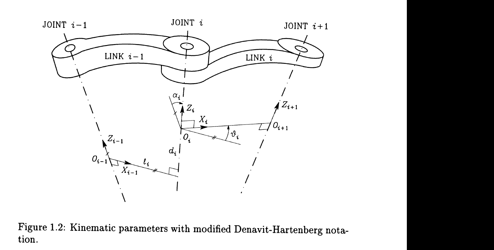

# Lecture 03 - Robot Kinematics and Dynamics

## Big Picture

Robot modeling has two halves. Kinematics tells us where the robot is; dynamics tells us what it takes to move it. Kinematics is geometry with joints. Dynamics is geometry with inertia, gravity, velocity coupling, and torque.

The key result of this lecture is the standard manipulator equation. Once a robot is written in that form, the rest of the course can design controllers around its structure rather than around a messy pile of separate equations.

## Learning Path

1. Describe robot pose using coordinate frames and transformations.
2. Map joint space to task space with direct kinematics.
3. Differentiate kinematics to obtain the Jacobian.
4. Derive manipulator dynamics using energy and Lagrange equations.
5. Identify the structural properties that make robot control possible.

## Robot Manipulator Modeling

Robotic manipulator modeling is divided into:

- Kinematics: motion without forces.
- Dynamics: motion with forces and torques.

A robot consists of links connected by joints. The configuration is described by generalized coordinates:

```math
q=\begin{bmatrix}q_1&q_2&\cdots&q_n\end{bmatrix}^T
```

For revolute joints, `q_i` is an angle. For prismatic joints, `q_i` is a displacement.

## Direct Kinematics

Direct kinematics maps joint variables to end-effector pose:

```math
x=h(q)
```

where `x` may include position and orientation.

Using homogeneous transformations:

```math
T=
\begin{bmatrix}
R&p\\
0&1
\end{bmatrix}
```

where:

- `R` is a rotation matrix,
- `p` is a position vector.

For an open-chain robot:

```math
T_n^0=T_1^0T_2^1\cdots T_n^{n-1}
```

## Denavit-Hartenberg Parameters

The lecture notes introduce the modified Denavit-Hartenberg notation. The point of DH notation is not to make kinematics mysterious; it is to make it repeatable. Instead of inventing a new geometry argument for every robot, we attach frames systematically and multiply standard transformations.

For a serial manipulator, joint `i` connects link `i-1` to link `i`. A frame is attached to each link.

### Frame assignment rules

For the modified DH convention used in the reference:

1. Choose `Z_i` aligned with the axis of joint `i`.
2. Choose `X_i` along the common normal between `Z_i` and `Z_{i+1}`, directed from joint `i` toward joint `i+1`.
3. Choose `Y_i` to complete a right-handed coordinate frame.



*Textbook screenshot source: [R2, Fig. 1.2].*

The figure shows the geometry used in the handwritten notes: adjacent joint axes are connected through common normals, and the four DH quantities describe the twist, length, rotation, and offset between two consecutive frames.

### Modified DH parameters

The four parameters are:

- `\alpha_i`: angle between `Z_{i-1}` and `Z_i` about `X_{i-1}`.
- `a_i` or `\ell_i`: distance between `Z_{i-1}` and `Z_i` along `X_{i-1}`.
- `\theta_i`: angle between `X_{i-1}` and `X_i` about `Z_i`.
- `d_i`: distance between `X_{i-1}` and `X_i` along `Z_i`.

Different books use slightly different symbols. The lecture/reference uses `\ell_i` for the distance along `X_{i-1}`; many robotics texts call this `a_i`.

### Transformation sequence

The modified DH transformation from frame `i-1` to frame `i` is:

```math
{}^{i-1}T_i
=
R_x(\alpha_i)\,T_x(a_i)\,R_z(\theta_i)\,T_z(d_i)
```

or, using the reference notation:

```math
{}^{i-1}T_i
=
\mathrm{Rot}(X,\alpha_i)
\mathrm{Trans}(X,\ell_i)
\mathrm{Rot}(Z,\theta_i)
\mathrm{Trans}(Z,d_i)
```

The corresponding matrix is:

```math
{}^{i-1}T_i=
\begin{bmatrix}
\cos\theta_i & -\sin\theta_i & 0 & a_i\\
\cos\alpha_i\sin\theta_i & \cos\alpha_i\cos\theta_i & -\sin\alpha_i & -d_i\sin\alpha_i\\
\sin\alpha_i\sin\theta_i & \sin\alpha_i\cos\theta_i & \cos\alpha_i & d_i\cos\alpha_i\\
0&0&0&1
\end{bmatrix}
```

### Joint variables

Two of the four parameters are always fixed by link geometry. The joint variable depends on the joint type:

- Revolute joint:

```math
q_i=\theta_i
```

- Prismatic joint:

```math
q_i=d_i
```

The remaining parameter is a constant offset.

It is common to write:

```math
\theta_i = q_i + \theta_{i0}
```

for revolute joints, or:

```math
d_i = q_i + d_{i0}
```

for prismatic joints.

### Composition of transformations

The transformation from base link `0` to link `n` is:

```math
{}^0T_n
=
{}^0T_1\,{}^1T_2\cdots{}^{n-1}T_n
```

If there is a base frame `b` different from frame `0`, and an end-effector/tool frame `e` different from frame `n`, then:

```math
{}^bT_e
=
{}^bT_0\,{}^0T_n\,{}^nT_e
```

This is the complete direct-kinematics transformation.

### Nonuniqueness and useful frame choices

DH frames are systematic, but not always unique. When there is freedom in frame placement, choose frames that make as many parameters as possible zero.

Useful simplifications:

- Choose frame `0` conveniently with respect to frame `1`.
- Choose the final frame `n` conveniently with respect to the tool frame.
- If a joint is prismatic, the direction of its `Z_i` axis is fixed but its location can often be chosen for algebraic simplicity.
- If adjacent joint axes are parallel, place the common normal to simplify offsets.

This is not cosmetic. Good frame choices can turn a frightening kinematics derivation into a tolerable one.

### Direct kinematics equation

After multiplying all link transformations, the end-effector pose can be written:

```math
{}^bT_e(q)=
\begin{bmatrix}
R(q)&p(q)\\
0&1
\end{bmatrix}
```

or, more abstractly:

```math
x=k(q)
```

where `x` is a task-space representation of position and orientation.

## Inverse Kinematics

Inverse kinematics asks:

```math
q=h^{-1}(x)
```

Given a desired end-effector pose `x_d`, find joint variables `q`.

The solution may be:

- unique,
- multiple,
- nonexistent,
- singularity-sensitive.

This is harder than direct kinematics because nonlinear equations must be solved.

### Why inverse kinematics is not simply "the inverse"

The direct map:

```math
q \mapsto x
```

is straightforward to evaluate once `q` is known. The inverse problem:

```math
x_d \mapsto q
```

may have:

- no solution, if the desired pose is outside the workspace,
- one solution,
- several solutions,
- infinitely many solutions for redundant robots,
- numerical difficulty near singular configurations.

For a typical six-degree-of-freedom manipulator, multiple inverse-kinematics solutions are common. The number of admissible solutions depends on the geometry and DH parameters.

### Spherical wrist and kinematic decoupling

A common structural simplification occurs when the last three revolute joint axes intersect at a point. This is called a spherical wrist.

Then inverse kinematics can be decoupled:

```text
desired end-effector pose
        |
        v
compute wrist-center position
        |
        v
solve arm joints q1, q2, q3
        |
        v
compute orientation left for wrist
        |
        v
solve wrist joints q4, q5, q6
```

This is the classic position/orientation split:

- first solve where the wrist center must be,
- then solve how the wrist must rotate the end effector.

## Joint Space and Task Space

Joint space:

```math
q\in\mathbb{R}^n
```

Task space:

```math
x\in\mathbb{R}^m
```

The robot may be controlled in joint space or task space. Which space is preferable depends on how the desired motion is specified.

## Differential Kinematics

Differentiate:

```math
x=h(q)
```

to obtain:

```math
\dot{x}=J(q)\dot{q}
```

where:

```math
J(q)=\frac{\partial h(q)}{\partial q}
```

is the Jacobian matrix.

The Jacobian maps joint velocities into task-space velocities.

For a spatial manipulator, the geometric end-effector velocity is:

```math
v_e=
\begin{bmatrix}
\dot{p}_e\\
\omega_e
\end{bmatrix}
```

where:

- `\dot{p}_e` is linear velocity,
- `\omega_e` is angular velocity.

The differential kinematics equation is:

```math
v_e=J(q)\dot{q}
```

where:

```math
J(q)\in\mathbb{R}^{6\times n}
```

for a spatial `n`-joint robot.

## Geometric Jacobian

The geometric Jacobian is built column by column from joint axes and position vectors obtained from direct kinematics.

Let:

- `z_{i-1}` be the axis of joint `i` expressed in the base frame,
- `o_{i-1}` be the origin of frame `i-1`,
- `o_e` be the end-effector origin.

For a revolute joint:

```math
J_{v_i}=z_{i-1}\times(o_e-o_{i-1})
```

```math
J_{\omega_i}=z_{i-1}
```

For a prismatic joint:

```math
J_{v_i}=z_{i-1}
```

```math
J_{\omega_i}=0
```

Therefore:

```math
J(q)=
\begin{bmatrix}
J_v(q)\\
J_\omega(q)
\end{bmatrix}
```

This formula is one of the most practical results in kinematics: once all frame origins and joint axes are known from forward kinematics, the Jacobian follows almost mechanically.

## Analytical Jacobian

The analytical Jacobian is obtained by differentiating a chosen minimal task-space representation:

```math
x=k(q)
```

so:

```math
\dot{x}=J_a(q)\dot{q}
```

where:

```math
J_a(q)=\frac{\partial k(q)}{\partial q}
```

The geometric and analytical Jacobians are not always the same. They coincide for the position part, but the orientation part depends on the chosen orientation representation.

Relationship:

```math
v_e=
\begin{bmatrix}
\dot{p}\\
\omega
\end{bmatrix}
=
T(\phi)\dot{x}
```

or equivalently:

```math
J(q)=T(\phi)J_a(q)
```

where `\phi` denotes the selected orientation parameters. If `T(\phi)` becomes singular, the analytical representation has a representation singularity even if the manipulator geometry itself is not singular.

## Acceleration-Level Kinematics

Differentiating again:

```math
\ddot{x}=J(q)\ddot{q}+\dot{J}(q,\dot{q})\dot{q}
```

The extra term:

```math
\dot{J}\dot{q}
```

is important in task-space control and dynamics-level transformations.

## Kinematic Singularities

A kinematic singularity occurs when the Jacobian loses rank:

```math
\mathrm{rank}\,J(q)<\min(6,n)
```

At a singularity:

- some task-space velocities cannot be generated,
- some joint velocities may produce no end-effector motion,
- inverse velocity kinematics can require unbounded joint velocities,
- the robot may lose controllable directions in task space.

For a square Jacobian, singularities can be found from:

```math
\det J(q)=0
```

For non-square Jacobians, use rank or singular values.

### Singular value interpretation

Use the singular value decomposition:

```math
J=U\Sigma V^T
```

The singular values measure how joint velocity directions are stretched into task velocity directions. If one singular value becomes zero, motion in the corresponding task-space direction is lost.

This is the clean geometric meaning of a singularity: the velocity ellipsoid collapses along at least one direction.

## Dynamic Modeling Methods

Two main approaches are discussed:

1. Newton-Euler method
2. Lagrange method

Newton-Euler:

- force and moment balance,
- efficient recursive computation,
- useful for numerical inverse dynamics.

Lagrange:

- energy based,
- compact symbolic derivation,
- convenient for controller analysis.

## Lagrange Equations

Define:

```math
L(q,\dot{q})=K(q,\dot{q})-P(q)
```

where:

- `K`: kinetic energy,
- `P`: potential energy.

For each generalized coordinate:

```math
\frac{d}{dt}\left(\frac{\partial L}{\partial \dot{q}_i}\right)
-
\frac{\partial L}{\partial q_i}
=
\tau_i
```

In vector form, this produces the manipulator dynamics.

## Energy Example for a Planar Manipulator

The handwritten notes work through the standard energy-based derivation pattern for a planar manipulator. The details below write the example in a clean symbolic form so the method is visible.

Kinetic energy has the general form:

```math
K=\frac{1}{2}\dot{q}^TM(q)\dot{q}
```

Potential energy is built from the heights of the links:

```math
P=\sum_i m_i g h_i(q)
```

The Lagrangian:

```math
L=K-P
```

is substituted into Lagrange's equation to derive torques:

```math
\tau_i=
\frac{d}{dt}\left(\frac{\partial L}{\partial \dot{q}_i}\right)
-
\frac{\partial L}{\partial q_i}
```

### Two-link planar arm template

For a two-link planar revolute manipulator:

```math
q=
\begin{bmatrix}
q_1\\
q_2
\end{bmatrix}
```

Let:

- `l_1,l_2`: link lengths,
- `l_{c1},l_{c2}`: distances from each joint to each link center of mass,
- `m_1,m_2`: link masses,
- `I_1,I_2`: link inertias about their centers of mass.

The center-of-mass positions are:

```math
p_{c1}=
\begin{bmatrix}
l_{c1}\cos q_1\\
l_{c1}\sin q_1
\end{bmatrix}
```

```math
p_{c2}=
\begin{bmatrix}
l_1\cos q_1+l_{c2}\cos(q_1+q_2)\\
l_1\sin q_1+l_{c2}\sin(q_1+q_2)
\end{bmatrix}
```

Differentiate to obtain linear velocities:

```math
\dot{p}_{c1}=J_{c1}(q)\dot{q}
```

```math
\dot{p}_{c2}=J_{c2}(q)\dot{q}
```

The angular velocities are:

```math
\omega_1=\dot{q}_1
```

```math
\omega_2=\dot{q}_1+\dot{q}_2
```

Kinetic energy:

```math
K=
\frac{1}{2}m_1\dot{p}_{c1}^T\dot{p}_{c1}
+
\frac{1}{2}I_1\dot{q}_1^2
+
\frac{1}{2}m_2\dot{p}_{c2}^T\dot{p}_{c2}
+
\frac{1}{2}I_2(\dot{q}_1+\dot{q}_2)^2
```

This can be collected as:

```math
K=\frac{1}{2}\dot{q}^TM(q)\dot{q}
```

with:

```math
M(q)=
\begin{bmatrix}
M_{11} & M_{12}\\
M_{21} & M_{22}
\end{bmatrix}
```

where:

```math
M_{11}
=
I_1+I_2
+m_1l_{c1}^2
+m_2\left(l_1^2+l_{c2}^2+2l_1l_{c2}\cos q_2\right)
```

```math
M_{12}=M_{21}
=
I_2+m_2\left(l_{c2}^2+l_1l_{c2}\cos q_2\right)
```

```math
M_{22}
=
I_2+m_2l_{c2}^2
```

Potential energy:

```math
P=
m_1g l_{c1}\sin q_1
+
m_2g\left(l_1\sin q_1+l_{c2}\sin(q_1+q_2)\right)
```

The gravity vector is:

```math
G(q)=\frac{\partial P}{\partial q}
```

so:

```math
G_1=
m_1g l_{c1}\cos q_1
+
m_2g\left(l_1\cos q_1+l_{c2}\cos(q_1+q_2)\right)
```

```math
G_2=
m_2g l_{c2}\cos(q_1+q_2)
```

The Lagrange equations:

```math
\frac{d}{dt}\left(\frac{\partial L}{\partial \dot{q}}\right)
-
\frac{\partial L}{\partial q}
=
\tau
```

produce:

```math
M(q)\ddot{q}+C(q,\dot{q})\dot{q}+G(q)=\tau
```

The important lesson is not the memorization of the two-link formula. The important lesson is the route: write center-of-mass positions, differentiate them for velocities, build kinetic and potential energies, form the Lagrangian, and then apply Lagrange equations to recover the standard robot dynamics.

## Standard Robot Equation

The standard manipulator equation is:

```math
M(q)\ddot{q}+V_m(q,\dot{q})\dot{q}+G(q)+F_d\dot{q}=\tau
```

or:

```math
M(q)\ddot{q}+C(q,\dot{q})\dot{q}+G(q)+F(\dot{q})=\tau
```

where:

- `M(q)`: inertia matrix,
- `V_m(q,\dot{q})\dot{q}` or `C(q,\dot{q})\dot{q}`: Coriolis and centrifugal effects,
- `G(q)`: gravity,
- `F_d\dot{q}`: viscous friction,
- `\tau`: applied joint torque.

## Structural Properties of Robot Dynamics

Important properties:

### Inertia matrix

```math
M(q)=M^T(q)>0
```

and there exist positive constants `m_1,m_2` such that:

```math
m_1\|x\|^2\le x^TM(q)x\le m_2\|x\|^2
```

### Skew-symmetry

The Coriolis matrix can be chosen so that:

```math
\dot{M}(q)-2V_m(q,\dot{q})
```

is skew-symmetric.

Therefore:

```math
x^T\left(\dot{M}-2V_m\right)x=0
```

This is a key identity in Lyapunov proofs.

### Friction and gravity bounds

Viscous friction:

```math
F_d\dot{q}
```

Gravity is bounded for typical manipulators:

```math
\|G(q)\|\le g_b
```

## Linear Parameterization

Robot dynamics can often be written as:

```math
M(q)\ddot{q}+V_m(q,\dot{q})\dot{q}+G(q)+F_d\dot{q}
=Y(q,\dot{q},\ddot{q})\theta
```

where:

- `Y` is a known regressor,
- `\theta` is a constant parameter vector.

This property is the basis of adaptive robot control.
