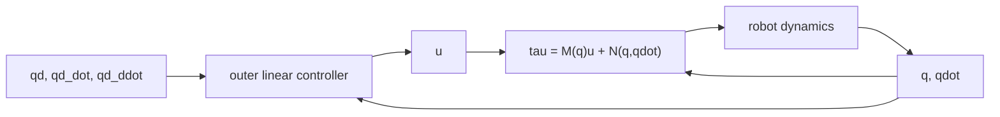

# Lecture 04 - Feedback Linearization and Computed-Torque Control

Original handwritten source: `Lex/Lecture04-05-06.pdf`, Lecture 4 portion

Reference check:

- Checked against Ref.1 feedback-linearization and computed-torque sections.
- Standard robot-control signs are kept consistent with `e=q_d-q`.

## Big Picture

Feedback linearization is the moment the robot equation becomes a design instrument. The nonlinear dynamics are not ignored; they are used. If the model is known, the controller can cancel the nonlinear terms and make the robot behave like a set of double integrators.

Computed-torque control is the robot-specific version of this idea. It separates the problem into an inner nonlinear cancellation loop and an outer linear tracking loop. Elegant, powerful, and a little vain: it performs beautifully when the model is right.

## Learning Path

1. Group all non-acceleration dynamics into `N(q,\dot{q})`.
2. Choose a torque input that makes `\ddot{q}=u`.
3. Design `u` using linear tracking-error dynamics.
4. Select gains from second-order system behavior.
5. Recognize the weakness: exact cancellation needs an accurate model.



## Feedback Linearization

For a manipulator:

```math
M(q)\ddot{q}+V_m(q,\dot{q})\dot{q}+G(q)+F_d\dot{q}=\tau
```

define:

```math
N(q,\dot{q})=V_m(q,\dot{q})\dot{q}+G(q)+F_d\dot{q}
```

Then:

```math
M(q)\ddot{q}+N(q,\dot{q})=\tau
```

Choose:

```math
\tau=M(q)u+N(q,\dot{q})
```

Substitution gives:

```math
\ddot{q}=u
```

Thus the nonlinear robot is converted into a set of double integrators.

## State-Space Form

Let:

```math
x=
\begin{bmatrix}
q\\
\dot{q}
\end{bmatrix}
```

Then, after feedback linearization:

```math
\dot{x}
=
\begin{bmatrix}
0&I\\
0&0
\end{bmatrix}x
+
\begin{bmatrix}
0\\
I
\end{bmatrix}u
```

The output may be chosen as:

```math
y=q
```

## Computed-Torque Control

For desired trajectory:

```math
q_d(t),\qquad \dot{q}_d(t),\qquad \ddot{q}_d(t)
```

define:

```math
e=q_d-q
```

```math
\dot{e}=\dot{q}_d-\dot{q}
```

Choose the outer-loop command:

```math
u=\ddot{q}_d+K_d\dot{e}+K_pe
```

Then:

```math
\tau=
M(q)\left(\ddot{q}_d+K_d\dot{e}+K_pe\right)
+N(q,\dot{q})
```

or expanded:

```math
\tau=
M(q)\left(\ddot{q}_d+K_d(\dot{q}_d-\dot{q})+K_p(q_d-q)\right)
+V_m(q,\dot{q})\dot{q}+G(q)+F_d\dot{q}
```

## Closed-Loop Error Dynamics

Since:

```math
\ddot{q}=u
```

then:

```math
\ddot{e}
=
\ddot{q}_d-\ddot{q}
=
\ddot{q}_d-u
```

Substitute `u`:

```math
\ddot{e}
=
-K_d\dot{e}-K_pe
```

Therefore:

```math
\ddot{e}+K_d\dot{e}+K_pe=0
```

If `K_p` and `K_d` are positive definite, the error dynamics are stable.

## Gain Selection

For each joint:

```math
\ddot{e}_i+k_{d,i}\dot{e}_i+k_{p,i}e_i=0
```

Compare with:

```math
s^2+2\zeta\omega_ns+\omega_n^2=0
```

Then:

```math
k_{p,i}=\omega_{n,i}^2
```

```math
k_{d,i}=2\zeta_i\omega_{n,i}
```

For critical damping:

```math
\zeta_i=1
```

## Computed-Torque Block Structure

Computed torque has two parts:

1. Inner nonlinear loop:

```math
\tau=M(q)u+N(q,\dot{q})
```

2. Outer linear feedback loop:

```math
u=\ddot{q}_d+K_d\dot{e}+K_pe
```

The inner loop cancels nonlinear dynamics; the outer loop sets tracking performance.

## Approximate Model Case

If only estimates are available:

```math
\hat{M}(q),\qquad \hat{N}(q,\dot{q})
```

then:

```math
\tau=\hat{M}(q)u+\hat{N}(q,\dot{q})
```

does not perfectly produce `\ddot{q}=u`. The error dynamics contain uncertainty. This motivates robust and adaptive control.

## Optimal Outer-Loop Design

Once the robot is feedback-linearized, the outer-loop error system is linear. One can choose:

```math
u=-Kx_e
```

where:

```math
x_e=
\begin{bmatrix}
q-q_d\\
\dot{q}-\dot{q}_d
\end{bmatrix}
```

For LQR:

```math
J=\int_0^\infty (x_e^TQx_e+u^TRu)dt
```

with:

```math
Q=Q^T\ge 0,\qquad R=R^T>0
```

The optimal gain:

```math
K=R^{-1}B^TP
```

where `P` solves:

```math
A^TP+PA-PBR^{-1}B^TP+Q=0
```

## PD Plus Gravity

For regulation to constant `q_d`, a simpler controller is:

```math
\tau=G(q)+K_p(q_d-q)-K_d\dot{q}
```

It compensates gravity but does not cancel inertia and Coriolis terms.

A Lyapunov function:

```math
V=
\frac{1}{2}\dot{q}^TM(q)\dot{q}
+
\frac{1}{2}(q_d-q)^TK_p(q_d-q)
```

can be used to show stability, with:

```math
\dot{V}=-\dot{q}^TK_d\dot{q}\le 0
```

after using robot dynamic properties.
