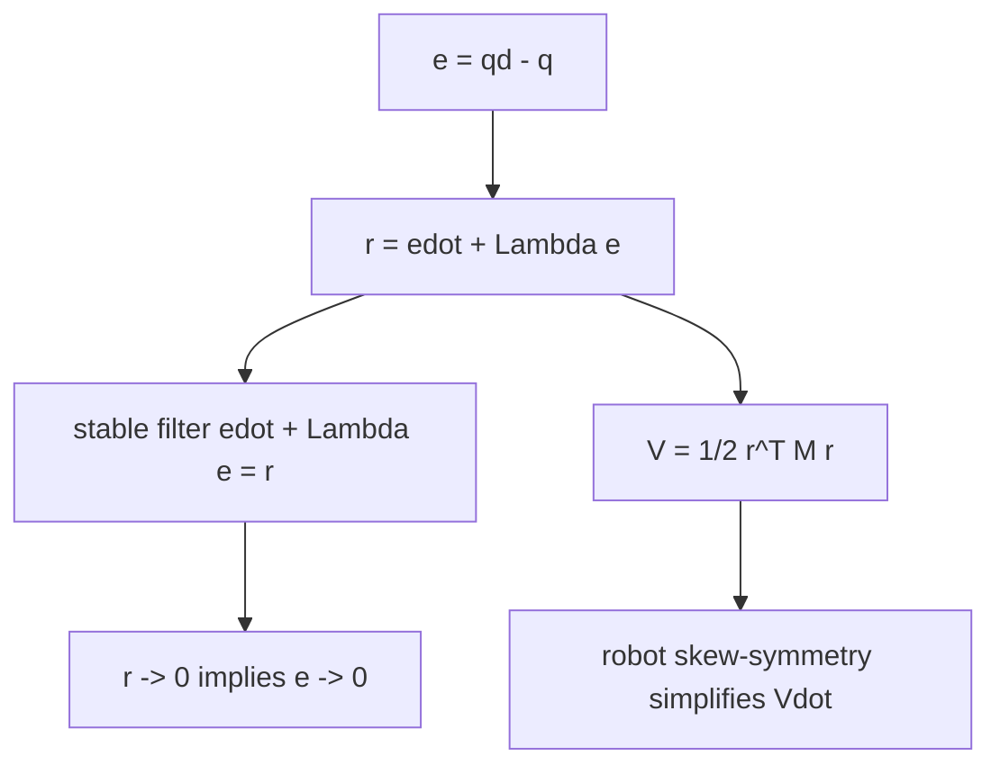

# Lecture 05 - Filtered Tracking Error

Original handwritten source: `Lex/Lecture04-05-06.pdf`, Lecture 5 portion

Reference check:

- The table of contents marks filtered tracking error as `/?`.
- This file follows the handwritten lecture notes and checks the result against standard robot adaptive/robust-control derivations.

## Big Picture

Filtered tracking error is a small definition with large consequences. Instead of controlling position error and velocity error separately, we combine them into one signal:

```math
r=\dot{e}+\Lambda e
```

If this signal goes to zero, the tracking error behaves like a stable first-order system. That is why robust and adaptive robot controllers so often chase `r`: it is a neat doorway from complicated second-order dynamics to a clean convergence argument.

## Learning Path

1. Define position tracking error.
2. Combine position and velocity error into a filtered error.
3. Show that `r=0` implies exponential decay of `e`.
4. Express robot dynamics in terms of `r`.
5. Use the inertia and skew-symmetry properties to build Lyapunov proofs.



## Textbook Guide

The filtered tracking error is the bridge from computed torque to robust and adaptive robot control. Ref. [R1] is the main support for the `r = edot + Lambda e` design pattern and the Lyapunov energy argument used in later controllers. See [Control Scheme Bibliography](Control_Scheme_Bibliography.md).

## Tracking Error

The lecture uses:

```math
e=q_d-q
```

Then:

```math
\dot{e}=\dot{q}_d-\dot{q}
```

## Filtered Tracking Error

Define:

```math
r=\dot{e}+\alpha e
```

or, for multi-DOF systems:

```math
r=\dot{e}+\Lambda e
```

where:

```math
\alpha>0
```

or:

```math
\Lambda=\Lambda^T>0
```

If:

```math
r=0
```

then:

```math
\dot{e}+\alpha e=0
```

which gives:

```math
e(t)=e(0)e^{-\alpha t}
```

Thus driving `r` to zero drives `e` to zero.

## Stable Filter Relation

From:

```math
\dot{e}+\alpha e=r
```

the solution is:

```math
e(t)=e(0)e^{-\alpha t}
+
\int_0^t e^{-\alpha(t-\sigma)}r(\sigma)d\sigma
```

If `r(t)` is bounded and converges to zero, then `e(t)` converges to zero.

## Integral Bound

Using Cauchy-Schwarz:

```math
\left|
\int_0^t e^{-\alpha(t-\sigma)}r(\sigma)d\sigma
\right|
\le
\left(
\int_0^t e^{-2\alpha(t-\sigma)}d\sigma
\right)^{1/2}
\left(
\int_0^t r^2(\sigma)d\sigma
\right)^{1/2}
```

Since:

```math
\int_0^t e^{-2\alpha(t-\sigma)}d\sigma
\le
\frac{1}{2\alpha}
```

boundedness of the `L_2` norm of `r` helps establish boundedness of `e`.

## Lemma Used in the Lecture

If:

- `r` is bounded,
- `r\in L_2`,
- `\dot{r}` is bounded,

then Barbalat's lemma implies:

```math
r(t)\to 0
```

Then, because:

```math
\dot{e}+\alpha e=r
```

the tracking error also satisfies:

```math
e(t)\to 0
```

and:

```math
\dot{e}(t)\to 0
```

under the usual boundedness assumptions.

## Reference Velocity and Acceleration

Define:

```math
\dot{q}_r=\dot{q}_d+\Lambda e
```

Then:

```math
r=\dot{q}_r-\dot{q}
```

Differentiate:

```math
\ddot{q}_r=\ddot{q}_d+\Lambda\dot{e}
```

These reference signals are essential in robust and adaptive controllers.

## Robot Dynamics in Terms of r

The robot dynamics are:

```math
M(q)\ddot{q}+V_m(q,\dot{q})\dot{q}+G(q)+F_d\dot{q}=\tau
```

Since:

```math
r=\dot{q}_r-\dot{q}
```

then:

```math
\dot{r}=\ddot{q}_r-\ddot{q}
```

Multiplying by `M(q)`:

```math
M(q)\dot{r}=M(q)\ddot{q}_r-M(q)\ddot{q}
```

This relation is used to rewrite closed-loop dynamics in terms of `r`.

## Lyapunov Function with Filtered Error

Choose:

```math
V=\frac{1}{2}r^TM(q)r
```

Then:

```math
\dot{V}
=
r^TM(q)\dot{r}
+
\frac{1}{2}r^T\dot{M}(q)r
```

Using the robot property:

```math
\dot{M}(q)-2V_m(q,\dot{q})
```

is skew-symmetric, so:

```math
r^T\left(\frac{1}{2}\dot{M}-V_m\right)r=0
```

This cancellation is why filtered-error coordinates are so common in robot robust/adaptive control.
