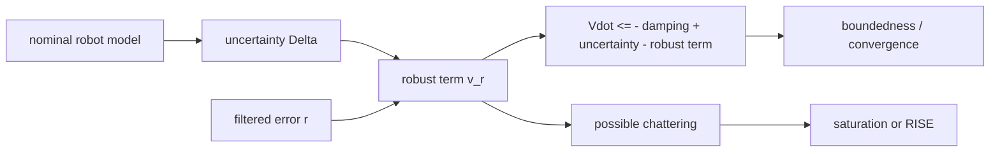

# Lecture 06 - Robust Control, Variable-Structure Control, and RISE

Original handwritten sources:

- `Lex/Lecture04-05-06.pdf`, Lecture 6 portion
- `Lex/Lecture06Suplementary.PDF`, supplementary RISE pages

Reference check:

- Robust control, variable-structure control, and RISE were marked as `/?` or lecture-based in the table of contents.
- The notes below follow the handwritten material and standard Lyapunov sign/bounding logic.

## Big Picture

Robust control begins where perfect modeling ends. If computed torque says "I know the robot exactly," robust control says "I know what I do not know, and I can dominate it." The lecture develops switching and sign-based ideas that force the filtered tracking error toward zero despite bounded uncertainty.

The price is practical: discontinuous control can chatter. The later RISE idea softens that price by integrating sign information, trying to keep robustness without making the applied torque violently discontinuous.

## Learning Path

1. Write the model uncertainty as a bounded disturbance-like term.
2. Use filtered error as the sliding variable.
3. Add a robust term that dominates uncertainty in the Lyapunov derivative.
4. Replace pure sign control by saturation when chattering is a concern.
5. Extend the idea to RISE by integrating sign-error information.



## Robust Control Motivation

Computed torque assumes the exact model:

```math
M(q),\quad V_m(q,\dot{q}),\quad G(q),\quad F_d
```

In practice, the controller uses estimated terms:

```math
\hat{M}(q),\quad \hat{V}_m(q,\dot{q}),\quad \hat{G}(q),\quad \hat{F}_d
```

The mismatch becomes uncertainty in the tracking error dynamics.

## Filtered Error Setup

Use:

```math
e=q_d-q
```

```math
r=\dot{e}+\Lambda e
```

and:

```math
\dot{q}_r=\dot{q}_d+\Lambda e
```

```math
\ddot{q}_r=\ddot{q}_d+\Lambda\dot{e}
```

Then:

```math
r=\dot{q}_r-\dot{q}
```

## Robust Controller Form

A common robust controller is:

```math
\tau=
\hat{M}(q)\ddot{q}_r
+
\hat{V}_m(q,\dot{q})\dot{q}_r
+
\hat{G}(q)
+
\hat{F}_d\dot{q}
+
K_rr
+
v_r
```

where `v_r` is the robustifying term.

The sign convention is chosen so the Lyapunov derivative contains:

```math
-r^TK_rr
```

plus uncertainty terms.

## Model-Parameter Uncertainty Form

For parameter uncertainty, the uncertain dynamics can be written with a regressor:

```math
M(q)\ddot{q}_r
+V_m(q,\dot{q})\dot{q}_r
+G(q)
+F_d\dot{q}
=
Y(q,\dot{q},\dot{q}_r,\ddot{q}_r)\theta
```

If the controller uses nominal parameters `\hat{\theta}`, then:

```math
Y\theta=Y\hat{\theta}+Y\tilde{\theta}
```

where:

```math
\tilde{\theta}=\theta-\hat{\theta}
```

The uncertainty entering the filtered-error dynamics is:

```math
\Delta=Y\tilde{\theta}
```

If:

```math
\|\tilde{\theta}\|\le \bar{\theta}
```

then:

```math
\|\Delta\|\le \|Y\|\bar{\theta}
```

Therefore, the robust gain may be chosen as:

```math
\rho(q,\dot{q},\dot{q}_r,\ddot{q}_r)
\ge
\|Y(q,\dot{q},\dot{q}_r,\ddot{q}_r)\|\bar{\theta}
```

This connects the switching/robust term to a specific uncertainty bound rather than to arbitrary large gain.

## Lyapunov Analysis

Choose:

```math
V=\frac{1}{2}r^TM(q)r
```

After substituting the closed-loop dynamics and using robot skew symmetry:

```math
\dot{V}
\le
-r^TK_rr+r^T\Delta-r^Tv_r
```

where `\Delta` is the lumped uncertainty.

If:

```math
\|\Delta\|\le \rho
```

then:

```math
r^T\Delta\le \rho\|r\|
```

Choose:

```math
v_r=\rho\frac{r}{\|r\|}
```

for `r\neq 0`, so:

```math
r^Tv_r=\rho\|r\|
```

and the uncertainty is dominated.

## Variable-Structure Control

Variable-structure control uses switching based on the sign of the error variable.

For scalar `r`:

```math
v_r=\rho\,\mathrm{sgn}(r)
```

For vector systems, the sign may be componentwise:

```math
v_r=
\begin{bmatrix}
\rho_1\mathrm{sgn}(r_1)\\
\vdots\\
\rho_n\mathrm{sgn}(r_n)
\end{bmatrix}
```

The switching surface is:

```math
r=0
```

On this surface:

```math
\dot{e}+\Lambda e=0
```

so tracking error decays exponentially.

## Sliding Condition

A sliding condition can be written:

```math
r^T\dot{r}<0
```

or in Lyapunov form:

```math
\dot{V}\le -\eta\|r\|
```

for some:

```math
\eta>0
```

This drives trajectories to the sliding surface.

## Chattering and Boundary Layer

The discontinuous sign function can cause chattering.

A practical replacement is saturation:

```math
\mathrm{sat}\left(\frac{r}{\phi}\right)
```

where `\phi` is a boundary-layer thickness.

Then:

```math
v_r=\rho\,\mathrm{sat}\left(\frac{r}{\phi}\right)
```

This reduces chattering but may result in practical convergence rather than exact convergence.

## Scalar Example

For a scalar uncertain system:

```math
m\ddot{x}=u+d
```

define:

```math
e=x_d-x
```

```math
r=\dot{e}+\alpha e
```

Use:

```math
V=\frac{1}{2}mr^2
```

A control with switching:

```math
u=m\ddot{x}_r+kr+\rho\mathrm{sgn}(r)
```

gives:

```math
\dot{V}\le -kr^2-(\rho-|d|)|r|
```

If:

```math
\rho>|d|
```

then the error decreases.

## RISE Supplement: Main Idea

RISE stands for robust integral of the sign of the error.

The goal is to obtain robust convergence while avoiding directly discontinuous torque.

Instead of applying only:

```math
\mathrm{sgn}(r)
```

instantaneously, RISE uses an integral of a sign-like term.

## RISE Error Variables

The supplement uses:

```math
e=q_d-q
```

```math
r=\dot{e}+\alpha e
```

and an additional filtered signal such as:

```math
s=\dot{r}+\beta r
```

The uncertain nonlinear dynamics are grouped into a term such as:

```math
N_d
```

with a known bound.

## RISE Control Structure

A RISE-like auxiliary control contains:

```math
\mu(t)=\int_0^t
\left(k r(\sigma)+\beta\mathrm{sgn}(r(\sigma))\right)d\sigma
```

The torque uses this integral term so the applied control can be continuous while still retaining robust sign-error information.

## RISE Lyapunov Function

The supplement uses a Lyapunov function of the form:

```math
V=
\frac{1}{2}s^TM(q)s
+
\frac{1}{2}r^Tr
+
P
```

where `P` is an auxiliary nonnegative term associated with the integral robust component.

The proof aims to show:

```math
\dot{V}\le -c\|z\|^2
```

or a related negative bound, where `z` stacks the error variables.

## RISE Gain Conditions

The robust gain must dominate the uncertainty bound:

```math
\beta>\Delta_{\max}
```

where `\Delta_{\max}` is the uncertainty bound.

Under the assumptions:

- signals remain bounded,
- filtered errors converge,
- tracking error converges.
