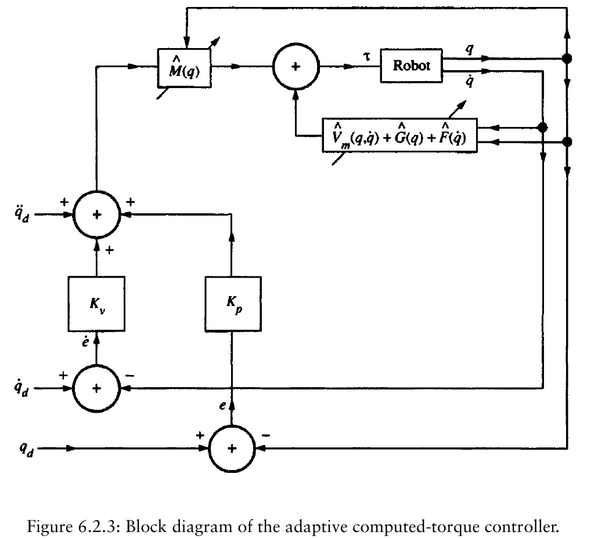
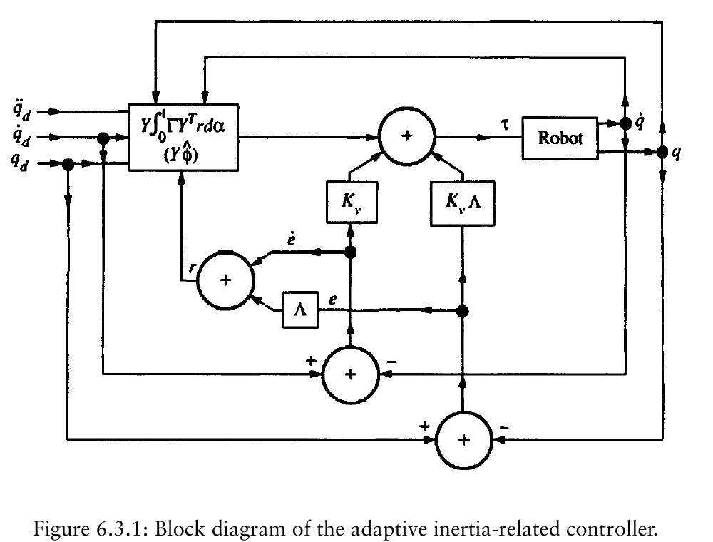

# Lecture 07 - Adaptive Control of Robot Manipulators

## Big Picture

Adaptive control is what happens when the robot model is structurally known but numerically uncertain. We keep the physics, replace unknown constants by estimates, and update those estimates while the robot moves.

The clever point is that adaptation is not tuning by wishful thinking. The update law is designed from the Lyapunov derivative so that parameter-error terms cancel rather than grow. Tracking can converge even when the estimated parameters do not become the true physical parameters; the robot may learn enough to behave well without learning everything.

## Learning Path

1. Express robot dynamics in a linear-in-parameters form.
2. Replace unknown parameters by estimates.
3. Add tracking feedback.
4. Build a Lyapunov function with both tracking error and parameter error.
5. Choose the parameter update law to cancel mixed terms.



*Textbook screenshot source: [R1, Fig. 6.2.3].*

## Textbook Guide

Ref. [R1] is the main source for adaptive computed-torque control, linear parameterization, and the Lyapunov update-law construction. Ref. [R2] is useful as a companion for passivity-based interpretations of robot adaptive control. See [Control Scheme Bibliography](Control_Scheme_Bibliography.md).

## Motivation for Adaptive Control

Adaptive control is introduced for robot manipulators with uncertain parameters.

The robot model is:

```math
M(q)\ddot{q}+V_m(q,\dot{q})\dot{q}+G(q)+F_d\dot{q}=\tau
```

The dynamic structure is known, but parameters such as masses, inertias, link lengths, friction coefficients, or gravity-related constants may be uncertain.

Adaptive control updates parameter estimates online:

```math
\hat{\theta}(t)
```

instead of assuming exact known parameters.

The goal is:

- maintain tracking despite uncertainty,
- keep all closed-loop signals bounded,
- possibly make parameter estimates converge if the trajectory is sufficiently exciting.

## Linear Parameterization

Robot dynamics can be written as:

```math
M(q)\ddot{q}+V_m(q,\dot{q})\dot{q}+G(q)+F_d\dot{q}
=Y(q,\dot{q},\ddot{q})\theta
```

where:

- `Y` is the regression matrix,
- `\theta` is a constant vector of unknown physical parameters.

For tracking controllers, the regressor often uses desired or reference accelerations:

```math
Y(q,\dot{q},\dot{q}_r,\ddot{q}_r)\theta
```

The important property is linearity in unknown parameters, not linearity in the states.

## Adaptive Computed-Torque Control

The lecture first presents adaptive control by a computed-torque approach.

For exact computed torque:

```math
\tau=M(q)\left(\ddot{q}_d+K_d\dot{e}+K_pe\right)+N(q,\dot{q})
```

When parameters are unknown, replace true parameters by estimates:

```math
\tau=\hat{M}(q)\left(\ddot{q}_d+K_d\dot{e}+K_pe\right)+\hat{N}(q,\dot{q})
```

or equivalently:

```math
\tau=Y(q,\dot{q},q_d,\dot{q}_d,\ddot{q}_d)\hat{\theta}
```

plus feedback terms depending on the exact derivation.

## Lyapunov Candidate With Parameter Error

Define parameter error:

```math
\tilde{\theta}=\theta-\hat{\theta}
```

A common Lyapunov candidate is:

```math
V=e_x^TPe_x+\tilde{\theta}^T\Gamma^{-1}\tilde{\theta}
```

where:

- `e_x` is the tracking-error state,
- `P=P^T>0`,
- `\Gamma=\Gamma^T>0` is the adaptation gain matrix.

The matrix `P` is often obtained from a Lyapunov equation for the chosen linear error dynamics.

## Choosing the Adaptation Law

The derivative of `V` contains a mixed term involving:

```math
\tilde{\theta}
```

and the regressor.

The update rule is chosen to cancel this mixed term.

Typical form:

```math
\dot{\hat{\theta}}=\Gamma Y^T B^TPe_x
```

or the sign-adjusted version, depending on how `e_x` is defined.

With this choice:

```math
\dot{V}\le -e_x^TQe_x
```

for some `Q=Q^T>0`.

## Important Observations

Adaptive control may guarantee tracking convergence without guaranteeing exact parameter convergence.

Tracking convergence usually requires:

- bounded reference trajectory,
- bounded desired derivatives,
- positive definite gains,
- correct regressor structure,
- stable adaptation law.

Parameter convergence requires extra excitation conditions.

## Inertia-Related Adaptive Control

The lecture then moves to an inertia-related or Slotine-Li style design.

Define:

```math
e=q_d-q
```

```math
r=\dot{e}+\Lambda e
```

Define reference velocity:

```math
\dot{q}_r=\dot{q}_d+\Lambda e
```

Then:

```math
r=\dot{q}_r-\dot{q}
```

and:

```math
\ddot{q}_r=\ddot{q}_d+\Lambda\dot{e}
```

## Adaptive Inertia-Related Controller



*Textbook screenshot source: [R1, Fig. 6.3.1].*

Using the regressor:

```math
Y(q,\dot{q},\dot{q}_r,\ddot{q}_r)\theta
=
M(q)\ddot{q}_r+V_m(q,\dot{q})\dot{q}_r+G(q)+F_d\dot{q}
```

choose:

```math
\tau=
Y(q,\dot{q},\dot{q}_r,\ddot{q}_r)\hat{\theta}
 +K_r r
```

with sign matched to `r=\dot{q}_r-\dot{q}`. This form is selected so that the closed-loop `r` dynamics contain:

```math
-K_r r + Y\tilde{\theta}
```

after substitution.

## Lyapunov Function for Inertia-Related Adaptive Control

Choose:

```math
V=
\frac{1}{2}r^TM(q)r
\frac{1}{2}\tilde{\theta}^T\Gamma^{-1}\tilde{\theta}
```

Differentiate:

```math
\dot{V}
=
r^TM\dot{r}
\frac{1}{2}r^T\dot{M}r
\tilde{\theta}^T\Gamma^{-1}\dot{\tilde{\theta}}
```

Use:

```math
\dot{\tilde{\theta}}=-\dot{\hat{\theta}}
```

and robot skew-symmetry:

```math
r^T\left(\frac{1}{2}\dot{M}-V_m\right)r=0
```

## Adaptation Law

The derivative can be arranged as:

```math
\dot{V}
=
-r^TK_r r
r^TY\tilde{\theta}
\tilde{\theta}^T\Gamma^{-1}\dot{\tilde{\theta}}
```

Choose:

```math
\dot{\hat{\theta}}=\Gamma Y^T r
```

for the lecture convention `r=\dot{q}_r-\dot{q}`.

Then:

```math
\dot{\tilde{\theta}}=-\Gamma Y^T r
```

and:

```math
\tilde{\theta}^T\Gamma^{-1}\dot{\tilde{\theta}}
=-\tilde{\theta}^TY^Tr
=-r^TY\tilde{\theta}
```

Thus:

```math
\dot{V}=-r^TK_r r\le 0
```

## Boundedness and Persistency of Excitation

From:

```math
\dot{V}\le 0
```

we conclude:

- `r` is bounded,
- `\tilde{\theta}` is bounded,
- `\hat{\theta}` is bounded,
- `r\in L_2` if `K_r>0`.

Using Barbalat-type arguments:

```math
r(t)\to 0
```

Then the stable filter:

```math
\dot{e}+\Lambda e=r
```

implies:

```math
e(t)\to 0
```

However, parameter convergence requires persistency of excitation.
