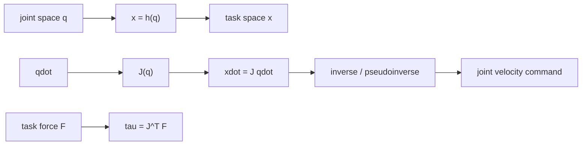
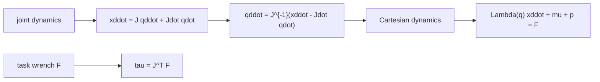

# Lecture 09 - Task-Space Control

Original handwritten source: `Lex/lecture09.pdf`

Reference check:

- Checked against the relevant Ref.2 task-space control section listed in `Table of Contents.pdf`.
- Some table entries were marked `/?`; handwritten lecture notes remain primary.

## Big Picture

Joint-space control asks the robot joints to behave. Task-space control asks the hand of the robot to behave. That shift sounds small until the Jacobian enters: now the controller must translate between the space where the task is specified and the space where the actuators actually live.

This lecture is about that translation. The Jacobian is the bridge, its inverse is useful when it exists, its pseudoinverse helps when the bridge is wider than the road, and its singularities remind us that geometry can be unforgiving.

## Learning Path

1. Define task variables through direct kinematics.
2. Use the Jacobian to relate joint and task velocities.
3. Solve inverse velocity kinematics using inverse or pseudoinverse Jacobians.
4. Use null-space motion for redundant manipulators.
5. Connect task-space forces to joint torques through `J^T`.



## Motivation

Up to this point, many controllers were written in joint space:

```math
q(t)\rightarrow q_d(t)
```

In many robot tasks, however, the desired motion is specified in task space:

```math
x(t)\rightarrow x_d(t)
```

where `x` describes end-effector position and/or orientation.

The task-space relation is:

```math
x=h(q)
```

Differentiating:

```math
\dot{x}=J(q)\dot{q}
```

where `J(q)` is the manipulator Jacobian.

## Kinematic Control

Kinematic control uses the differential kinematic relation to generate joint commands from task-space commands.

If the Jacobian is square and nonsingular:

```math
\dot{q}=J^{-1}(q)\dot{x}
```

For desired task velocity:

```math
\dot{x}_d
```

one may choose:

```math
\dot{q}=J^{-1}(q)\left(\dot{x}_d+K_x(x_d-x)\right)
```

Then task-space error:

```math
e_x=x_d-x
```

can be made to satisfy:

```math
\dot{e}_x+K_xe_x=0
```

if the inverse is exact and nonsingular.

## Pseudoinverse

If `J` is not square, use the pseudoinverse:

```math
\dot{q}=J^\dagger(q)\dot{x}
```

For a full row-rank Jacobian:

```math
J^\dagger=J^T(JJ^T)^{-1}
```

For a full column-rank Jacobian:

```math
J^\dagger=(J^TJ)^{-1}J^T
```

The pseudoinverse gives a least-squares or minimum-norm solution depending on the dimensions and rank.

## Redundant Manipulators

A manipulator is kinematically redundant if it has more joints than needed for the task:

```math
n>m
```

where:

- `n`: number of joints,
- `m`: task dimension.

Then the null space of `J` is nonempty.

The general velocity solution is:

```math
\dot{q}=J^\dagger\dot{x}+(I-J^\dagger J)\dot{q}_0
```

The term:

```math
(I-J^\dagger J)\dot{q}_0
```

does not affect task-space velocity because:

```math
J(I-J^\dagger J)=0
```

for the ideal full-rank case.

## Null-Space Objectives

The lecture notes mention that the null-space term can be used for secondary objectives:

- avoid joint limits,
- avoid obstacles,
- avoid singularities,
- optimize manipulability,
- reduce energy,
- choose a comfortable posture.

A common form:

```math
\dot{q}_0=k_0\nabla H(q)
```

where `H(q)` is a performance or avoidance function.

## Damped Least-Squares Inverse

Near singularities, the pseudoinverse can produce very large joint velocities.

Damped least squares modifies the inverse:

```math
J^\#=J^T(JJ^T+\lambda^2I)^{-1}
```

where:

```math
\lambda>0
```

The damping improves numerical behavior near singularities but introduces tracking approximation error.

## Jacobian Transpose Method

Instead of using the inverse Jacobian, task-space forces can be mapped to joint torques:

```math
\tau=J^T(q)F
```

where `F` is a task-space force-like control input.

For task-space regulation:

```math
F=K_p(x_d-x)-K_d\dot{x}
```

Then:

```math
\tau=J^T(q)\left(K_p(x_d-x)-K_d\dot{x}\right)
```

The transpose method avoids matrix inversion and can be robust near singularities, but the convergence behavior depends on Jacobian rank and gain choices.

## Cartesian Dynamics

Joint dynamics:

```math
M(q)\ddot{q}+C(q,\dot{q})\dot{q}+G(q)=\tau
```

Task velocity:

```math
\dot{x}=J(q)\dot{q}
```

Task acceleration:

```math
\ddot{x}=J(q)\ddot{q}+\dot{J}(q,\dot{q})\dot{q}
```

This equation is the first warning that task-space control is not obtained by simply replacing `q` with `x`. The velocity relation has only one derivative of the Jacobian hidden in it, but the acceleration relation exposes the extra term:

```math
\dot{J}(q,\dot{q})\dot{q}
```

If `J` is square and nonsingular, then:

```math
\dot{q}=J^{-1}\dot{x}
```

and:

```math
\ddot{q}=J^{-1}\left(\ddot{x}-\dot{J}\dot{q}\right)
```

Substituting this into the joint dynamics gives a task-space dynamic model. One common operational-space form is:

```math
\Lambda(q)\ddot{x}+\mu(q,\dot{q})+p(q)=F
```

where:

```math
\Lambda(q)=J^{-T}M(q)J^{-1}
```

for the square nonsingular case. The terms `\mu` and `p` collect the velocity-dependent and gravity effects after the coordinate transformation. A useful way to remember the structure is:

- `M(q)` becomes a task-space inertia `\Lambda(q)`,
- `C(q,\dot{q})\dot{q}` becomes a task-space Coriolis/centrifugal term plus contributions from `\dot{J}\dot{q}`,
- `G(q)` becomes a task-space gravity term,
- task-space wrench `F` maps to joint torque through `\tau=J^TF`.

For redundant manipulators, the clean inverse `J^{-1}` is replaced by dynamically consistent or pseudoinverse mappings, and null-space torques may appear. Near singularities, `\Lambda` can become ill-conditioned because the robot loses the ability to generate arbitrary task accelerations or forces.



## Direct Task-Space Regulation

The reference treatment separates two strategies:

- kinematic task-space control: convert `x_d` into joint references and use a joint-space controller,
- direct task-space control: put task errors directly inside the torque law.

For a desired constant task point `x_d`, define:

```math
e_x=x_d-x
```

A direct task-space PD controller with gravity compensation is:

```math
\tau=J_a^T(q)K_pe_x-J_a^T(q)K_DJ_a(q)\dot{q}+G(q)
```

where `J_a` is the analytical Jacobian used for the chosen task coordinates. Since:

```math
\dot{x}=J_a(q)\dot{q}
```

the damping term may also be read as:

```math
-J_a^TK_D\dot{x}
```

The Lyapunov candidate is the natural energy:

```math
V=\frac{1}{2}\dot{q}^TM(q)\dot{q}
+
\frac{1}{2}e_x^TK_pe_x
```

Using the skew-symmetry property of `\dot{M}-2C`, the derivative becomes:

```math
\dot{V}=-\dot{q}^TJ_a^TK_DJ_a\dot{q}
=-\dot{x}^TK_D\dot{x}\le 0
```

If `J_a` remains full rank and the desired task point is reachable, the end-effector error converges to zero. This result is the task-space counterpart of the joint-space PD plus gravity controller.

## Direct Task-Space Tracking

For time-varying task trajectories, direct task-space inverse dynamics uses:

```math
\tau=M(q)u_0+C(q,\dot{q})\dot{q}+G(q)
```

which produces:

```math
\ddot{q}=u_0
```

The acceleration-level task relation is:

```math
\ddot{x}=J_a(q)u_0+\dot{J}_a(q,\dot{q})\dot{q}
```

Thus choose:

```math
u_0=J_a^\dagger
\left[
\ddot{x}_d
+K_D(\dot{x}_d-\dot{x})
+K_P(x_d-x)
-\dot{J}_a\dot{q}
\right]
```

For a square nonsingular `J_a`, the pseudoinverse reduces to the ordinary inverse. Then:

```math
\ddot{e}_x+K_D\dot{e}_x+K_Pe_x=0
```

with:

```math
e_x=x_d-x
```

This is exactly the same desired second-order error equation used in joint-space computed torque, now produced through the task-space differential kinematics.

## Reference-Velocity Task-Space Form

The lecture also connects task-space tracking with the filtered-error style used earlier. Define a reference task velocity:

```math
\dot{x}_r=\dot{x}_d+\Lambda_x(x_d-x)
```

and the corresponding joint reference:

```math
\dot{q}_r=J_a^\dagger(q)\dot{x}_r
```

with:

```math
\ddot{q}_r
=
J_a^\dagger(q)
\left(\ddot{x}_r-\dot{J}_a(q,\dot{q})\dot{q}_r\right)
```

or the corresponding expression obtained by differentiating the chosen inverse mapping. Then a passivity-style task-space controller can be written in joint torque form:

```math
\tau=
M(q)\ddot{q}_r
+C(q,\dot{q})\dot{q}_r
+G(q)
+J_a^T(q)K_D(\dot{x}_r-\dot{x})
```

This mirrors the joint-space controller:

```math
\tau=M\ddot{q}_r+C\dot{q}_r+G+K_D(\dot{q}_r-\dot{q})
```

but uses task-space velocity error inside the damping injection.

## Task-Space Control of Nonredundant Manipulators

For nonredundant systems, if `J` is invertible:

```math
\ddot{q}=J^{-1}(\ddot{x}-\dot{J}\dot{q})
```

This can be combined with joint-space inverse dynamics to construct task-space computed torque.

## Task-Space Control of Redundant Manipulators

For redundant manipulators:

```math
\ddot{q}=J^\dagger(\ddot{x}-\dot{J}\dot{q})+(I-J^\dagger J)\ddot{q}_0
```

The null-space term handles secondary objectives while the main term follows the task.

## Stability Comments

Task-space stability depends on:

- nonsingularity or rank of `J`,
- positive definite gains,
- correct handling of `\dot{J}\dot{q}`,
- avoiding or damping singularities,
- consistency between task-space force and joint torque.
