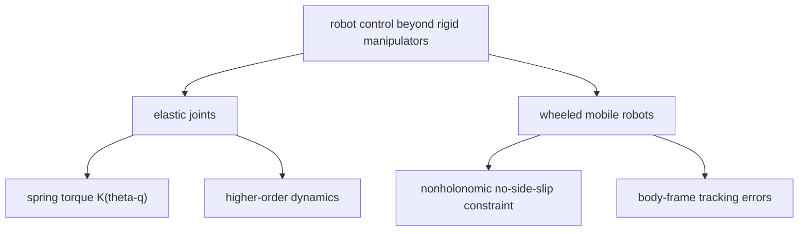
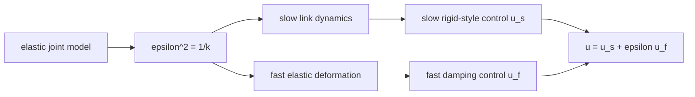

# Lecture 10 - Flexible/Elastic Joints and Wheeled Mobile Robots

Original handwritten source: `Lex/lecture10.pdf`

Reference check:

- Flexible/elastic joint material checked against the relevant Ref.2 elastic-joint section listed in `Table of Contents.pdf`.
- Wheeled mobile robot material was marked `/?`; handwritten notes are primary, with standard nonholonomic robot models used for verification.

## Big Picture

This lecture widens the course beyond rigid manipulators. Flexible joints show what happens when the actuator and the link are not the same coordinate. Wheeled mobile robots show what happens when motion is constrained by rolling geometry rather than by ordinary joint actuation.

The shared lesson is that control design is never independent of mechanics. A spring in a joint and a no-side-slip wheel constraint both change what the controller is allowed to accomplish.

## Learning Path

1. Separate motor coordinates from link coordinates in elastic-joint robots.
2. See how joint stiffness creates higher-order dynamics.
3. Understand why rigid-joint controllers may fail on flexible systems.
4. Model wheeled mobile robots with nonholonomic constraints.
5. Design posture and tracking errors in body-frame coordinates.



## Part A - Flexible and Elastic Joint Manipulators

Rigid-joint manipulators assume motor motion and link motion are the same. Flexible-joint manipulators separate motor and link coordinates.

Let:

```math
q = \text{link coordinate}
```

```math
\theta = \text{motor coordinate}
```

Elasticity creates torque through the difference:

```math
K(\theta-q)
```

where `K` is joint stiffness.

## Elastic Joint Dynamics

A typical elastic-joint model is:

```math
M(q)\ddot{q}+C(q,\dot{q})\dot{q}+G(q)=K(\theta-q)
```

```math
J_m\ddot{\theta}+K(\theta-q)=\tau
```

where:

- `M(q)`: link inertia,
- `J_m`: motor inertia,
- `K`: joint stiffness,
- `\tau`: motor torque.

The system order is higher than the rigid-joint model.

## Complete Elastic-Joint Model

For an `n`-joint manipulator with elastic transmissions, the configuration needs two sets of coordinates:

```math
q_1=\text{link coordinates}
```

```math
q_2=\text{motor coordinates reflected through gear ratios}
```

The joint deformation is:

```math
q_1-q_2
```

The elastic potential energy is:

```math
U_e=\frac{1}{2}(q_1-q_2)^TK(q_1-q_2)
```

where:

```math
K=\operatorname{diag}(k_1,\ldots,k_n)>0
```

Using the Lagrange formulation, the complete model has `2n` generalized coordinates and only `n` direct control inputs, because the actuators apply torque to the motor coordinates while the links are actuated through the springs. A compact full-model form is:

```math
H(q_1)
\begin{bmatrix}
\ddot{q}_1\\
\ddot{q}_2
\end{bmatrix}
+
C(q_1,\dot{q}_1,\dot{q}_2)
\begin{bmatrix}
\dot{q}_1\\
\dot{q}_2
\end{bmatrix}
+
\begin{bmatrix}
G(q_1)\\
0
\end{bmatrix}
+
\begin{bmatrix}
K(q_1-q_2)\\
-K(q_1-q_2)
\end{bmatrix}
=
\begin{bmatrix}
0\\
\tau
\end{bmatrix}
```

The important structural facts are:

- the inertia matrix is symmetric positive definite,
- the usual skew-symmetry property can still be arranged for `\dot{H}-2C`,
- the link-side direct kinematics depend on `q_1`, not on `q_2`,
- the system is underactuated in generalized coordinates because there are `2n` coordinates but only `n` motor torques.

This is why elastic-joint control is harder than rigid-joint control even when the physical difference is "just a spring."

## Control Difficulty

Elasticity introduces internal dynamics and oscillations.

A controller designed for:

```math
q=\theta
```

may not stabilize the elastic system.

The controller must account for:

- link position tracking,
- motor dynamics,
- spring torque,
- vibration damping.

## Singular Perturbation Idea

If joint stiffness is large, the elastic joint model may be approximated as a fast-slow system.

The rigid-joint model corresponds to the limit:

```math
K\to\infty
```

In that limit:

```math
\theta\approx q
```

For finite stiffness, the difference `\theta-q` must be controlled or damped.

## Reduced Model

The reduced model is obtained by simplifying the complete dynamics while keeping the essential elastic coupling. In the common reduced form, the link equation keeps the rigid-link manipulator dynamics, while the motor equation is driven by spring deformation and applied motor torque:

```math
M(q_1)\ddot{q}_1+C(q_1,\dot{q}_1)\dot{q}_1+G(q_1)+K(q_1-q_2)=0
```

```math
B\ddot{q}_2-K(q_1-q_2)=\tau
```

where `B` is the reflected motor inertia matrix. Compared with the complete model, the reduced model is easier to use for nonlinear control design. It is also the model usually rewritten in singularly perturbed form.

## One-Link Elastic Joint Example

For one revolute elastic joint in a vertical plane:

```math
I_l\ddot{q}_1+mgl\sin q_1+k(q_1-q_2)=0
```

```math
I_m\ddot{q}_2-k(q_1-q_2)=u
```

Define the elastic force:

```math
z=-k(q_1-q_2)
```

Then:

```math
I_l\ddot{q}_1+mgl\sin q_1=z
```

The first equation is slow: it describes the link motion driven by elastic force. The fast variable is the spring force/deformation, which reacts quickly when `k` is large.

Introduce:

```math
\epsilon^2=\frac{1}{k}
```

Large stiffness means small `\epsilon`. The singular perturbation view says:

- slow subsystem: link motion `q_1,\dot{q}_1`,
- fast subsystem: elastic force or deformation,
- rigid-joint limit: set `\epsilon=0` and solve the algebraic fast equation.

The resulting slow reduced system behaves like an equivalent rigid manipulator:

```math
(I_l+I_m)\ddot{q}_1+mgl\sin q_1=u_s
```

where `u_s` is the slow part of the motor torque. A natural slow controller is therefore the rigid inverse-dynamics law:

```math
u_s=(I_l+I_m)u_{s0}+mgl\sin q_1
```

with:

```math
u_{s0}=\ddot{q}_{1d}+k_d(\dot{q}_{1d}-\dot{q}_1)+k_p(q_{1d}-q_1)
```

The complete two-time-scale input is usually read as:

```math
u=u_s+\epsilon u_f
```

where `u_f` damps the fast elastic dynamics. The slow part achieves the desired rigid-body behavior; the fast part prevents spring oscillations from spoiling that behavior.



## PD Control Using Motor Variables

A practical result emphasized in the elastic-joint material is that simple linear control can work well for point-to-point motion, especially when only motor-side measurements are available.

For a desired link set point `q_d`, static equilibrium requires a motor reference that accounts for gravity and spring deflection:

```math
q_{2d}=q_d+K^{-1}G(q_d)
```

up to the sign convention used for the elastic torque. The idea is simple: at rest, the spring torque must balance gravity at the desired link posture.

A motor-side PD controller is then:

```math
\tau=K_P(q_{2d}-q_2)-K_D\dot{q}_2
```

For the one-link case this becomes:

```math
u=k_p(q_{2d}-q_2)-k_d\dot{q}_2
```

The important exam point is subtle: the proportional reference is shifted so that the motor settles at the value that produces the correct link equilibrium, while the velocity feedback is kept on the motor side to damp the directly actuated coordinate. If gravity or stiffness is uncertain, the equilibrium shift may be wrong, and a pure motor-variable integral term does not automatically fix the link error unless the integral action is driven by link-side error.

## Part B - Wheeled Mobile Robots

The lecture then moves to wheeled mobile robots.

The key difference from manipulators is that wheeled robots often have nonholonomic constraints.

A nonholonomic constraint is a velocity constraint that cannot be integrated into a pure position constraint.

## Unicycle Model

A common wheeled robot model:

```math
\dot{x}=v\cos\theta
```

```math
\dot{y}=v\sin\theta
```

```math
\dot{\theta}=\omega
```

where:

- `(x,y)` is position,
- `\theta` is heading,
- `v` is linear velocity,
- `\omega` is angular velocity.

The no-side-slip constraint is:

```math
-\sin\theta\,\dot{x}+\cos\theta\,\dot{y}=0
```

## Rolling Constraints and Posture Kinematic Model

For a wheeled mobile robot, the configuration is restricted by rolling-without-slipping constraints. In compact form, the admissible posture velocity is written as:

```math
\dot{z}=B(z)u
```

where:

```math
z=
\begin{bmatrix}
x\\
y\\
\theta
\end{bmatrix}
```

and `u` is a velocity-like input vector. For the unicycle:

```math
B(z)=
\begin{bmatrix}
\cos\theta & 0\\
\sin\theta & 0\\
0 & 1
\end{bmatrix}
```

with:

```math
u=
\begin{bmatrix}
v\\
\omega
\end{bmatrix}
```

Thus:

```math
\dot{z}
=
\begin{bmatrix}
\cos\theta & 0\\
\sin\theta & 0\\
0 & 1
\end{bmatrix}
\begin{bmatrix}
v\\
\omega
\end{bmatrix}
```

This compact representation is the posture kinematic model.

## Mobility, Steerability, and Manoeuvrability

The mobile-robot reference classifies wheeled robots using two structural numbers:

```math
\delta_m=\text{degree of mobility}
```

```math
\delta_s=\text{degree of steerability}
```

The degree of mobility is the dimension of the instantaneous posture velocity space. It counts how many independent posture directions can be produced directly without first changing steering angles.

The degree of steerability counts how many independent steering variables can be changed. These variables affect posture motion indirectly because the steering angles must first move before they reshape the admissible velocity directions.

The degree of manoeuvrability is:

```math
\delta_M=\delta_m+\delta_s
```

Interpretation:

- `\delta_m=3`: omnidirectional posture motion is instantaneously possible.
- `\delta_m=2`: only two independent posture velocities are immediately available, as in the unicycle/differential-drive class.
- `\delta_m=1`: the robot is more restricted instantaneously and relies more heavily on steering or multi-step maneuvers.
- larger `\delta_s` can improve manoeuvrability, but not instantaneously; steering takes time and enters through integrator-like dynamics.

Typical structural classes include:

| Type | Meaning |
|---|---|
| `(3,0)` | fully omnidirectional without steering variables |
| `(2,0)` | unicycle/differential-drive style restricted mobility |
| `(2,1)` | two direct mobility directions plus one steering direction |
| `(1,1)` | one direct mobility direction plus one steering direction |
| `(1,2)` | one direct mobility direction plus two steering directions |

The ideal instantaneous case is:

```math
\delta_m=\delta_M=3
```

which corresponds to omnidirectional motion.

## Posture Error

For a desired posture:

```math
x_d,\quad y_d,\quad \theta_d
```

define errors in the robot body frame:

```math
e_x=\cos\theta(x_d-x)+\sin\theta(y_d-y)
```

```math
e_y=-\sin\theta(x_d-x)+\cos\theta(y_d-y)
```

```math
e_\theta=\theta_d-\theta
```

This transformation makes the control design easier because errors are measured relative to the robot orientation.

## Regulation Problem

The regulation problem is to drive:

```math
e_x,e_y,e_\theta \to 0
```

For nonholonomic systems, smooth time-invariant feedback cannot globally asymptotically stabilize all postures under certain conditions. This is a classic mobile-robot control issue.

The lecture notes use time-varying or nonlinear control ideas to handle the posture problem.

## Tracking Problem

For trajectory tracking, desired velocities are:

```math
v_d,\qquad \omega_d
```

The controller chooses:

```math
v,\qquad \omega
```

based on posture errors.

A standard form is:

```math
v=v_d\cos e_\theta+k_xe_x
```

```math
\omega=\omega_d+k_ye_y+k_\theta\sin e_\theta
```

or a related form depending on the lecture notation.

## Lyapunov Analysis

A common Lyapunov function:

```math
V=\frac{1}{2}e_x^2+\frac{1}{2}e_y^2+\frac{1}{2}e_\theta^2
```

or a modified form involving:

```math
1-\cos e_\theta
```

is used to prove stability.

The derivative is shaped by choosing `v` and `\omega` so that:

```math
\dot{V}\le 0
```

or:

```math
\dot{V}<0
```

outside the desired equilibrium.
