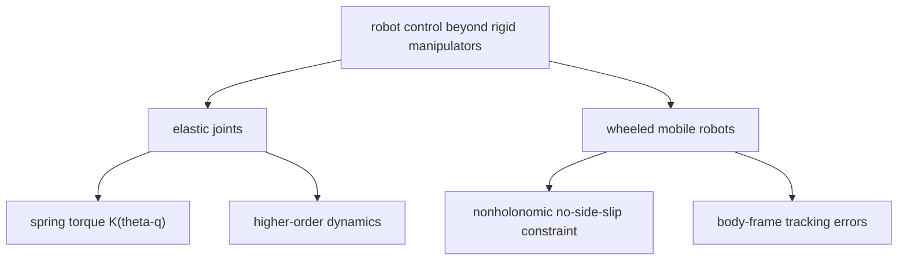

# Lecture 10 - Flexible/Elastic Joints and Wheeled Mobile Robots

Original handwritten source: `Lex/lecture10.pdf`

Reference check:

- Flexible/elastic joint material checked against the relevant Ref.2 elastic-joint section listed in `Table of Contents.pdf`.
- Wheeled mobile robot material was marked `/?`; handwritten notes are primary, with standard nonholonomic robot models used for verification.

## Big Picture

This lecture widens the course beyond rigid manipulators. Flexible joints show what happens when the actuator and the link are not the same coordinate. Wheeled mobile robots show what happens when motion is constrained by rolling geometry rather than by ordinary joint actuation.

The shared lesson is that control design is never independent of mechanics. A spring in a joint and a no-side-slip wheel constraint both change what the controller is allowed to accomplish.

## Learning Path

1. Separate motor coordinates from link coordinates in elastic-joint robots.
2. See how joint stiffness creates higher-order dynamics.
3. Understand why rigid-joint controllers may fail on flexible systems.
4. Model wheeled mobile robots with nonholonomic constraints.
5. Design posture and tracking errors in body-frame coordinates.



## Part A - Flexible and Elastic Joint Manipulators

Rigid-joint manipulators assume motor motion and link motion are the same. Flexible-joint manipulators separate motor and link coordinates.

Let:

```math
q = \text{link coordinate}
```

```math
\theta = \text{motor coordinate}
```

Elasticity creates torque through the difference:

```math
K(\theta-q)
```

where `K` is joint stiffness.

## Elastic Joint Dynamics

A typical elastic-joint model is:

```math
M(q)\ddot{q}+C(q,\dot{q})\dot{q}+G(q)=K(\theta-q)
```

```math
J_m\ddot{\theta}+K(\theta-q)=\tau
```

where:

- `M(q)`: link inertia,
- `J_m`: motor inertia,
- `K`: joint stiffness,
- `\tau`: motor torque.

The system order is higher than the rigid-joint model.

## Control Difficulty

Elasticity introduces internal dynamics and oscillations.

A controller designed for:

```math
q=\theta
```

may not stabilize the elastic system.

The controller must account for:

- link position tracking,
- motor dynamics,
- spring torque,
- vibration damping.

## Singular Perturbation Idea

If joint stiffness is large, the elastic joint model may be approximated as a fast-slow system.

The rigid-joint model corresponds to the limit:

```math
K\to\infty
```

In that limit:

```math
\theta\approx q
```

For finite stiffness, the difference `\theta-q` must be controlled or damped.

## Part B - Wheeled Mobile Robots

The lecture then moves to wheeled mobile robots.

The key difference from manipulators is that wheeled robots often have nonholonomic constraints.

A nonholonomic constraint is a velocity constraint that cannot be integrated into a pure position constraint.

## Unicycle Model

A common wheeled robot model:

```math
\dot{x}=v\cos\theta
```

```math
\dot{y}=v\sin\theta
```

```math
\dot{\theta}=\omega
```

where:

- `(x,y)` is position,
- `\theta` is heading,
- `v` is linear velocity,
- `\omega` is angular velocity.

The no-side-slip constraint is:

```math
-\sin\theta\,\dot{x}+\cos\theta\,\dot{y}=0
```

## Posture Error

For a desired posture:

```math
x_d,\quad y_d,\quad \theta_d
```

define errors in the robot body frame:

```math
e_x=\cos\theta(x_d-x)+\sin\theta(y_d-y)
```

```math
e_y=-\sin\theta(x_d-x)+\cos\theta(y_d-y)
```

```math
e_\theta=\theta_d-\theta
```

This transformation makes the control design easier because errors are measured relative to the robot orientation.

## Regulation Problem

The regulation problem is to drive:

```math
e_x,e_y,e_\theta \to 0
```

For nonholonomic systems, smooth time-invariant feedback cannot globally asymptotically stabilize all postures under certain conditions. This is a classic mobile-robot control issue.

The lecture notes use time-varying or nonlinear control ideas to handle the posture problem.

## Tracking Problem

For trajectory tracking, desired velocities are:

```math
v_d,\qquad \omega_d
```

The controller chooses:

```math
v,\qquad \omega
```

based on posture errors.

A standard form is:

```math
v=v_d\cos e_\theta+k_xe_x
```

```math
\omega=\omega_d+k_ye_y+k_\theta\sin e_\theta
```

or a related form depending on the lecture notation.

## Lyapunov Analysis

A common Lyapunov function:

```math
V=\frac{1}{2}e_x^2+\frac{1}{2}e_y^2+\frac{1}{2}e_\theta^2
```

or a modified form involving:

```math
1-\cos e_\theta
```

is used to prove stability.

The derivative is shaped by choosing `v` and `\omega` so that:

```math
\dot{V}\le 0
```

or:

```math
\dot{V}<0
```

outside the desired equilibrium.
